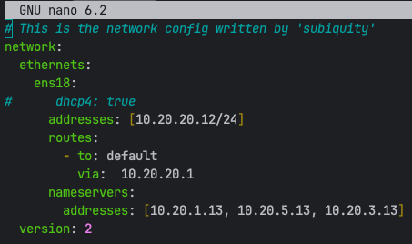
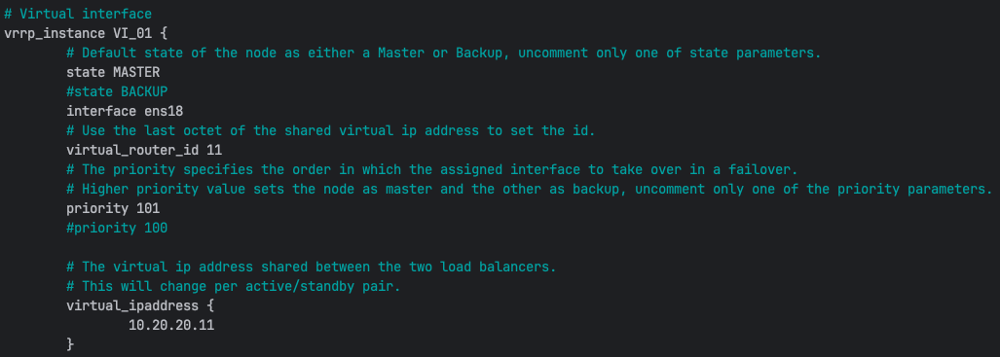
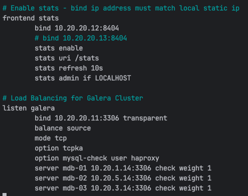
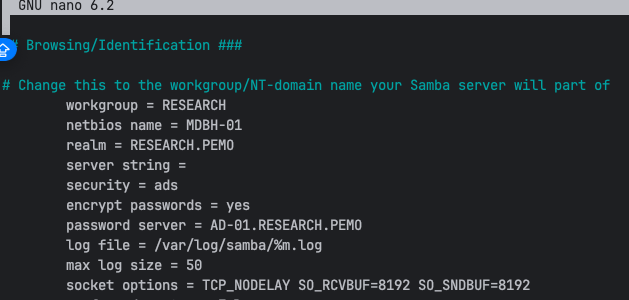

# MariaDB HAProxy Main Content Steps
Ensure that there exist a functional MariaDB Galera Cluster before creating the HAProxy Load Balancers.
HAProxy is a software package that can be installed on Linux flavored operating systems which in turn allows the OS to act as a reverse proxy and 
load balancer. 

> **Reverse Proxy** - sits in front of your server and accepts request from clients on its behalf.   
> **Load Balancer** - will split incoming requests among a cluster of servers, keeps track of which server got the 
                      last request, and the server that should get the next request utilizing the cluster equally. 
___
1. Access the Proxmox hypervisor web interface using a web browser and enter the following url in the specified format:  
    `https://Your-Servers-IP-Address:8006/` 
2. If a base haproxy template (**base-haproxy-template**) is available see the
   [MariaDB HAProxy Server Node Setup](#Mariadb-haproxy-server-node-setup) section, if not continue to **step 3** in **this section**:
3. If a base ubuntu template (**base-ubuntu-template**) is available see the **haproxy_template** document then return 
   to **this document** and jump to **step 2** in **this section**, if not continue in **this section** to **step 4**.
4. If no base Ubuntu template is available then see the **base-ubuntu build sheet** document which should be located 
   under the **scada** share on the research **NAS**, then return to **this section** and jump to **step 3**.
5. Steps Complete. 

## MariaDB HAProxy Server Node Setup
___
1. Perform a full clone of base haproxy template (**base-haproxy-template**) by right-clicking and then set the following 
   settings below:  

   > Mode = Full Clone  
   > Target Storage = Same as source  
   > Name = mdbh-XX (where XX is the server number being created)  
   > Resource Pool = None  
   > Format = QEMU image format    
   > VM ID = <next_available_address>  

   > If the virtual machine needs to be under a different PROXMOX node (pm-01, pm-02, ...pm-XX) then initiate a **migration** 
     to the necessary PROXMOX node before modifying or starting the virtual machine.  

2. Update the **Hardware** setting parameters to the values below:  
    
   **Memory**:   
   > Memory (MiB) = 4096  
   > Minimum memory (MiB) = 1024  
   > Ballooning Device = True  
   > All other parameters = Default 

   **Processors**:  
   > Processors Sockets = 1  
   > Processors Cores = 4  
   > All other parameters = Default  

3. Set the **Start at boot** checkbox to **true** using the **Options** section from the content panel:  
      
4. Start the virtual machine using the **Start** button.
5. Update the hostname from **base-haproxy-template** to **mdbh-XX** (where XX is the server number being creating) using the following command:
   ```shell
   sudo nano /etc/hostname
   ```
6. Update the hosts file using the following command:  
   ```shell
   sudo nano /etc/hosts
   ```
   Remove, update, and uncomment the lines based on the image below with respect to the server being configured:  
     
7. Reset the machine ID using the following commands:
   ```shell
   sudo  rm  -f  /etc/machine-id /var/lib/dbus/machine-id
   sudo dbus-uuidgen --ensure=/etc/machine-id
   sudo dbus-uuidgen --ensure
   ```
8. Regenerate ssh keys using the following commands:
   ```shell
   sudo rm /etc/ssh/ssh_host_*
   sudo dpkg-reconfigure openssh-server
   ```
9. Change the network interface IP address from **DHCP** to **Static** by editing the **00-installer-config.yaml** file, using the following command:   
    ```shell
    sudo nano /etc/netplan/00-installer-config.yaml
    ```
   Under the network interface key comment out the **dhcp4** key:value pair and then uncomment the remaining lines and configure the network settings accordingly see the image below:  
     
   IP Address per node server should fall within the following subnets:
   
   > mdbh-01 - 10.20.20.12/24 and gateway 10.20.20.1  
   > mdbh-02 - 10.20.20.13/24 and gateway 10.20.20.1
   
10. Restart the machine using the following command:
     ```shell
     sudo reboot
     ```
11. Check for OS updates by issuing the following commands in the order below:  
    ```shell
    sudo apt update -y
    sudo apt upgrade -y
    ```
12. Setup the firewall rules to allow incoming traffic from the following types of traffic:  
    **MariaDB database:**
    ```shell
    sudo ufw allow 3306/tcp
    ```
    **Allow traffic from mdbh-02 (10.20.20.13) using the mdbh-01 bash shell:**  
    ```shell
    sudo ufw allow from 10.20.20.13
    ```
    **Allow traffic from mdbh-01 (10.20.20.12) using the mdbh-02 bash shell:**  
    ```shell
    sudo ufw allow from 10.20.20.12
    ```
13. Update the **keepalived** file for load balancing and high-availability using the following command:  
    ```shell
    sudo nano /etc/keepalived/keepalived.conf
    ```
    Update **keepalived.conf** file according to the image below:  
       
    
    **NOTE 1: The configuration file will need to be updated and the following parameters will change per MASTER/BACKUP pair:**

   > **state** - If one node is the MASTER, the other will be the BACKUP.  
   > **interface** - Check the interface name being used.   
   > **virtual_router_id** - Use the last octet of the virtual IP address.  
   > **priority** - The MASTER (101) will have a higher priority than the BACKUP (100).  
   > **virtual_ipaddress** - Check the available IP network reserved for virtual routers.  
   
14. Update the **haproxy** file for load balancing and high-availability using the following command:   
    ```shell
    sudo nano /etc/haproxy/haproxy.cfg
    ```
    Placing the following text at the end of the file:  
    ```shell
    # Enable two instances of the stats webpage for display, monitoring, and health status.
    frontend stats
            mode tcp
            # The shared virtual IP and port number that'll be used to access the stats web page. 
            bind 10.20.20.11:8404
            # The MASTER/BACKUP IP address and port number used to create another instance of the stats web server 
            # to allow a haproxy load balancer listen section to be created and displayed on the stats web page 
            # that'll show the health status of the haproxy load balancers. Only uncomment one bind parameter that's 
            # based on the localhost for which the configuration is being configured for. 
            #bind 10.20.20.12:10404
            #bind 10.20.20.13:10404
            stats enable
            stats uri /stats
            stats refresh 10s
            stats admin if LOCALHOST
    
    # The shared virtual IP and port number that's used to check the health status of the haproxy load balancers.
    listen mariadb_load_balancers
            bind 10.20.20.11:10404 transparent
            balance source
            server mdbh-01 10.20.20.12:10404 check
            server mdbh-02 10.20.20.13:10404 check

    # The shared virtual IP and port number that's used to pass client request to the MariaDB Galera Cluster.
    listen mariadb_galera_cluster
            bind 10.20.20.11:3306 transparent
            balance source
            mode tcp
            option tcpka
            option mysql-check user haproxy
            server mdb-01 10.20.1.14:3306 send-proxy check weight 1
            server mdb-02 10.20.5.14:3306 send-proxy check weight 1
            server mdb-03 10.20.3.14:3306 send-proxy check weight 1
    ```
    The updated **haproxy.cfg** file should look similar to the image below:  
      
    
    **frontend stats**:  
   > **frontend stats** - Create a frontend named "stats". Defines how request should be listened for and what initial
     processing should be carried out.  
   > **bind 10.20.20.12:8404** -  The local IP address and port that HAProxy will listen for incoming connections.
     Comment and uncomment only one IP address.   

   **listen galera section**:   
   > **listen galera** - Create a listen configuration named "galera".  
   > **bind 10.20.20.11:3306 transparent** - HAProxy will listen on the specified IP address using transparent proxying,
     preserving client connection information.  
   > **balance source** - The load balancing algorithm is set to source, meaning it will choose which server to send client
     requests to based on the client's IP address.  
   > **option tcpka** - This enables TCP keep-alive on client and server sides.   
   > **option mysql-check user haproxy** - Enables a health check that specifically checks if a MariaDB server is healthy.
     The user haproxy is used for performing health checks, this user needs to be created in each MariaDB server and has
     enough privileges to log in and execute commands necessary for the health check.  
   > **server mdb-XX 10.20.Y.Y:3306 check weight 1** - Defines a server within a backend or listening group. The "check" word 
     tells HAProxy to periodically check the health of the MariaDB server by attempting a connection and if the server doesn't respond 
     to the health check then HAProxy will stop sending traffic until it starts responding successfully the health check again.
     The "weight 1" option informs HAProxy of the server's importance relative to other servers in the cluster. A higher weight
     means it will handle more connections.
   
15. In each MariaDB server specify the two mariadb haproxy nodes from which the haproxy user 
    can connect to the MariaDB databases, using the following SQL commands from the mariadb shell:  
    Access the MariaDB shell as the root user and prompt for the root password:  
    ```shell
    sudo mariadb -u root -p
    ```
    Create the haproxy user using the following SQL command:  
    ```sql
    CREATE USER 'haproxy'@'10.20.20.12';
    CREATE USER 'haproxy'@'10.20.20.13';
    ```
    Verify the user and hosts were created by executing the following SQL command:  
    ```sql
    SELECT User, Host FROM mysql.user;
    ```
    **NOTE: If an error is received when attempting to create the user on the other nodes, then run the SQL command above
    to verify if the user already exist because the user may have been propagated to the other MariaDB servers from the
    initial creation since a high-availability cluster exist.***  

16. Enable and start the **keepalived** and **haproxy** service using the following commands:  
    ```shell
    sudo systemctl enable --now keepalived
    sudo systemctl enable --now haproxy
    ```
    The status of the **keepalived** and **haproxy** service can be checked using the following commands:   
    ```shell
    sudo systemctl is-active keepalived
    sudo systemctl is-active haproxy
    ```
17. You can verify the state of each Keepalived node by examining the Keepalived logs:
    ```shell
    grep "Keepalived" /var/log/syslog
    ```

18. Join the MariaDB server to the Active Directory:  
    1. Edit the Samba configuration file using the following command:
       ```shell 
       sudo nano /etc/samba/smb.conf
       ```
       Update the value of the variable `netbios name` to the server node name being created in the `[global]` section. This 
       should be the only variable that needs to be updated across each server node configuration file. See the image
       below for clarification:  
         
    2. Enable and restart the `Samba` service to start up automatically at boot using the following commands:   
       ```shell
       sudo systemctl enable smbd
       ``` 
       ```shell
       sudo systemctl restart smbd
       ```
    3. Join the machine to active directory domain using the following command:
       ```shell
       sudo net ads join -S AD-01.RESEARCH.PEMO -U <user_in_ad_domain>
       ```
       `<user_in_ad_domain>` - is a user who has privileges in the AD domain to add a computer.  
    4. Enable and restart the `winbind` service to start up automatically at boot using the following commands:
       ```shell
       sudo systemctl enable winbind
       ```
       ```shell
       sudo systemctl restart winbind
       ```
       Verify that `winbind` service established a connection to the active directory domain by running the command below:
       ```shell
       sudo wbinfo -u
       ```
       This command will return a list of users from the domain that is connected via `winbind`.  

    5. Verify AD login acceptance into the machine by logging out and in with your AD account. 
19. Install `SentinelOne` cybersecurity software to detect, protect, and remove malicious software. The following sub steps
    will explain how to install `SentinelOne` by mounting a NAS (network attached storage) device then accessing the install files
    on the NAS. There are other methods for installation along with uninstalling, and upgrading `SentinelOne`, if any
    other method is needed then see the `SentinelOne` setup document that's under a PEMO Site Automation GitHub repository.  
    1. Check that the latest `SentinelOne` package is on the research scada share if not then you can download the last package
       then replace the existing package, see the image below on finding the latest package on the web management console:  
         
    2. Make note and verify the site token for the site that the machine will join, the site token for a site can be found using
       the following image for reference, click the site to find the site token:  
         
    3. Install the network file system packages if not already installed using the following command:   
       ```shell
       sudo apt install nfs-common
       ```
    4. Create a NFS directory on the local machine to share using a similar command to the following:  
       ```shell
       sudo mkdir -p /mnt/scada/nas
       ```
    5. Allow full permissions (read, write, execute) for the owner, group and others using a similar command to the following:  
       ```shell
       sudo chmod 777 /mnt/scada/nas
       ```
    6. Check that the correct NFS share is available on the NFS server using a similar command to the following:  
       ```shell
       showmount -e cnas-01.research.pemo
       ```
       If the NFS share is not available then check the following on the NAS:  
       - Ensure the share folder is created.  
       - Check the location of the share folder.  
       - Check the NFS permission rules.  
       - See step 5 under `Deploy Galera Arbitrator` section for more solutions.  

    7. Mount the external NFS share on machine using a similar command to the following:  
       ```shell
       sudo mount -t nfs cnas-01.research.pemo:/volume1/scada /mnt/scada/nas
       ```
    8. Change directories to the location where the files and shell script are located using a similar command to the following:  
       ```shell
       sudo cd /mnt/scada/nas/program_install_files/sentinel_one
       ```
       If denied access to the NFS share then change owner of the directory using a similar command to the following:  
       ```shell
       sudo chown <user or user:group> /mnt/scada/nas
       ```
    9. Once in the `SentinelOne` directory execute the shell script `sentinelone_linux_agent_install.sh` using the following command:  
       ```shell
       sudo ./sentinelone_linux_agent_install.sh
       ```
       Ensure that the latest packages from step 1 is in the directory and that the shell script contains the correct path 
       to the latest package and site token (with respect to the site that the machine will join).
       Use the following command to open the shell script, if necessary:  
       ```shell
       sudo nano sentinelone_linux_agent_install.sh
       ```
    10. Open up the `SentinelOne` web management console and verify the machine joined the Sentinels endpoint list, check the image below:  
          
20. Repeat steps 1 - 13 above for every MariaDB HAProxy server node created.  
21. Jump to step 5 in the [MariaDB HAProxy Main Content Steps](#mariadb-haproxy-main-content-steps) section.