# MariaDB Server Node Main Content Steps
___
1. Access the Proxmox hypervisor web interface using a web browser and enter the following url in the specified format:  
    **https://Your-Servers-IP-Address:8006/** 
2. If a base MariaDB template (`base-mdb-template`) is available right click and clone the virtual machine template and 
   set the following settings below, if not continue in `this` section to **step 3**:  
   > Mode = Full Clone  
   > Target Storage = Same as source  
   > Name = mdb-XX (where XX is the server number being created)  
   > Resource Pool = None  
   > Format = QEMU image format  

   > If a migration is needing to be performed to another PROXMOX node then perform the migration first before modifying or starting the virtual machine. 

   1. Jump to the [MariaDB Server Node Setup](#mariadb-server-node-setup) section.
   2. Jump to **step 5** in `this` section.
3. If a base ubuntu template (**base-ubuntu-template**) is available, see the **mariadb_template** document then return 
   to **this** document and jump to **step 2** in **this** section, if not continue in **this** section to **step 4**.  
4. If no base Ubuntu template is available then see the **base-ubuntu build sheet** document which should be located under 
   the **scada** share on the research **NAS**.  
   1. Jump to step 3 in **this** section.
5. Jump to the [Galera Cluster Setup](#galera-cluster-setup) section.
6. Jump to the [Galera Arbitrator Setup](#galera-arbitrator-setup) section.
7. Jump to the [MariaDB Backup Node Setup](#mariadb-backup-node-setup) section.  
8. Create the MariaDB HAProxy servers using the **mariadb_haproxy** document. 
___

## MariaDB Server Node Setup
___
1. Add a secondary hard disk to the MariaDB node using the **Hardware** section from the content panel:  
    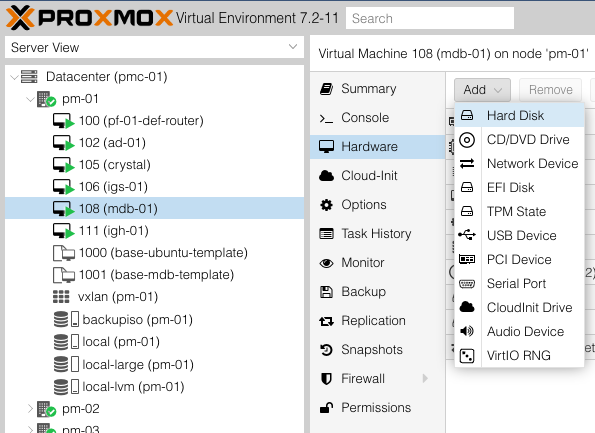  
    Set the hard disk configuration settings based on the following image and ensure that the **Backup** checkbox is **false**:  
    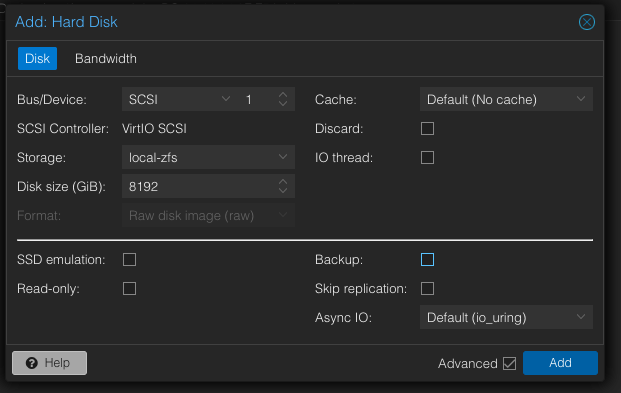
2. Set the **Start at boot** checkbox to **true** using the **Options** section from the content panel:  
   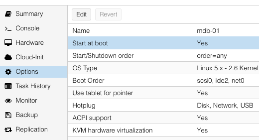   
3. Start the virtual machine using the `Start` button.
4. Update the hostname from `mdb-template` to `mdb-XX` (where XX is the server number being creating) using the following command:
   ```shell
   sudo nano /etc/hostname
   ```
5. Update the hosts file using the following command:  
   ```shell
   sudo nano /etc/hosts
   ```
   Remove, update, and uncomment the lines based on the image below with respect to the server being configured:  
     
6. Reset the machine ID using the following commands:
   ```shell
   sudo  rm  -f  /etc/machine-id /var/lib/dbus/machine-id
   sudo dbus-uuidgen --ensure=/etc/machine-id
   sudo dbus-uuidgen --ensure
   ```
7. Regenerate ssh keys using the following commands:
   ```shell
   sudo rm /etc/ssh/ssh_host_*
   sudo dpkg-reconfigure openssh-server
   ```
8. Change the network interface IP address from DHCP to Static by editing the `00-installer-config.yaml` file using the following command:   
    ```shell
    sudo nano /etc/netplan/00-installer-config.yaml
    ```
   Under the network interface key comment out the `dhcp4` key:value pair and then uncomment the remaining lines and configure the network settings accordingly see the image below:  
   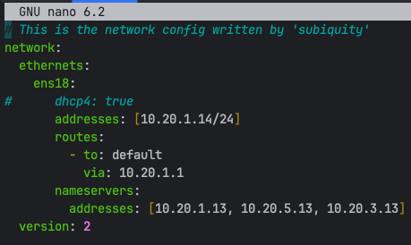  
   IP Address per node server should fall within the following subnets:
   > mdb-01 - 10.20.1.14/24 and gateway 10.20.1.1  
   > mdb-02 - 10.20.5.14/24 and gateway 10.20.5.1  
   > mdb-03 - 10.20.3.14/24 and gateway 10.20.3.1  

    Accept the network settings by issuing the command below:
    ```shell
    sudo netplan try
    ```
9. Restart the machine using the following command `sudo reboot`.
10. Check for OS updates by issuing the following commands in the order below:  
    ```shell
    sudo apt-get update
    sudo apt-get upgrade
    ```
11. Edit MariaDB with Galera cluster configuration file using the command below: 
    ```shell
    sudo nano /etc/mysql/mariadb.conf.d/60-galera.cnf
    ```
    Uncomment the necessary lines and update the value of the key variables with respect to the server being created as in the image below:  
    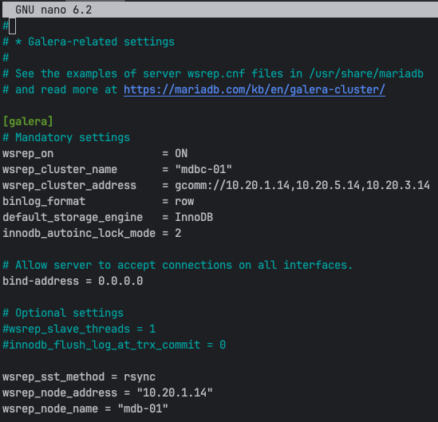  
    The following key-values pairs that'll be the same and different across each server node configuration file:  
    ```ini
    wsrep_cluster_name = "mdbc-01" # The value should be the same in all server node configuration files part of the same cluster
    wsrep_node_address = "10.20.X.X" # This will be updated per server node being created
    wsrep_node_name = "mdb-xx" # This will be updated per server node being created.
    ```
12. Format and partition the secondary disk:
     1. Switch to the root user account using the command below this will prevent having to type `sudo` for every superuser command typed:
        ```shell
        sudo su
        ```
     2. Find the secondary disk that will be formatted by typing the following command:
        ```shell
        fdisk -l
        ```
        The file structure path for the secondary hard disk should look like **/dev/sdb**.   
     3. Once the disk is located start the partition process by typing the following command which redirects to the parted shell:
        ```shell
         parted /dev/sdb
        ```
         In the parted shell create a new disk label of type GPT (GUID Partition Table):
        ```shell
        mklabel gpt
        ```
         In the parted shell change the unit of measurement to terabytes and then type the `print` command to see the changes:
        ```shell
        unit TB
        ```
     4. In the parted shell make a new primary partition that spans from the beginning of the disk to the max size by issuing the following command then exit out of the parted shell by typing `quit`:
         ```shell
        mkpart primary 0.00TB 8.80TB
        ```
        The secondary storage should now be partitioned. You can easily tell if a partition was created by identifying 
        a number that's appended to the end of the secondary devices name, which would look like **/dev/sdb1** type the  
        following command to verify:  
        ```shell
        fdisk -l
        ```
     5. Create and prepare a physical volume for use by issuing the following command:
        ```shell
        pvcreate /dev/sdb1
        ```
     6. If any **ERRORS** occur when performing **steps 3-5** above try the following commands, then repeat **steps 3-5** again:  
        If the volume group name from step 7 below exist before creating the volume group name then remove it:  
        ```shell
        vgdisplay
        vgremove -f vg-sql
        ```
     7. Create a new volume group that includes the new physical volume that was created in step 5 above:
        ```shell
        vgcreate vg-sql /dev/sdb1
        ```
     8. Create a logical volume that uses 100% of the free space available in new volume group:
        ```shell
        lvcreate -n lv-sql --extents 100%FREE vg-sql
        ```
     9. Create file system of type ext4 (4th extended journaling file system) on the new logical volume:
         ```shell
         mkfs.ext4 /dev/vg-sql/lv-sql
         ```
        The volume group and logical volume can be viewed using the following commands:  
        ```shell
        vgdisplay
        lvdisplay
        ```
     10. Create a directory to mount the new file system:
         ```shell 
         mkdir /mnt/sql-data
         ```
     11. Type the command `blkid`, copy the UUID of the new file system, and edit the file system table configuration 
         file using the command below:  
         ```shell 
         nano /etc/fstab
         ```
         The UUID of the new file system to copy should look similar to the image below:  
         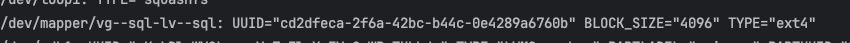  
         Copy the text below and place the text at the end of the file system table configuration file:  
         ```text
         UUID="<UUID_NUMBER_OF_FILE_SYSTEM>" /mnt/sql-data ext4 defaults 0 1 
         ```
     12. Type the following command  to mount the additional filesystem that was added to the `/etc/fstab `file:    
         ```shell
         mount -a
         ```
         Display the filesystem type in a human-readable format using the following command:    
         ```shell
         df -Th
         ```
         Reboot the machine and use the same command above to verify the filesystem mounts on boot up.  
13. Edit the MariaDB server configuration file `/etc/mysql/mariadb.conf.d/50-server.cnf` using the following command:  
    ```shell 
    sudo nano /etc/mysql/mariadb.conf.d/50-server.cnf
    ```
    Uncomment and set `datadir = /mnt/sql-data/data` in the top `[mariadbd]` section as in the image below:  
    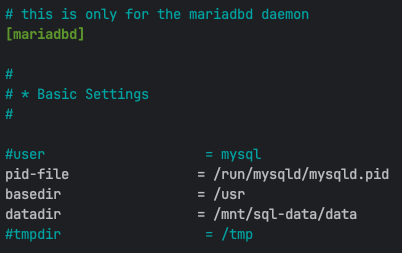  
    Uncomment the various error log variables as in the image below:  
      
    Add the following system variables to the bottom of `[mariadbd]` section to enable the MariaDB server audit plugin:  
    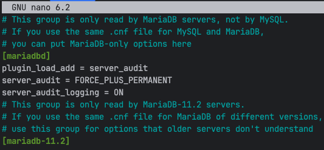  
14. Stop the MariaDB service using the following command:
    ```shell 
    sudo systemctl stop mariadb.service
    ```
15. Create a data directory using the following command:
    ```shell 
    sudo mkdir /mnt/sql-data/data
    ```
16. Change the ownership and contents of the data directory recursively to the mysql user and mysql group:
    ```shell
    sudo chown -R mysql:mysql /mnt/sql-data
    ```
17. Copy everything from `/var/lib/mysql/` directory to the data directory recursively while preserving the file attributes using the command below:
    ```shell
    sudo cp -R -p /var/lib/mysql/* /mnt/sql-data/data
    ```
18. Start the MariaDB service using the following command:
    ```shell 
    sudo systemctl start mariadb.service
    ```
    If the MariaDB service doesn't start then temporary initialization of the galera custer may need to be performed using the following command:  
    ```shell 
    sudo galera_new_cluster
    ```
    The status of the MariaDB service can be checked using the following command:  
    ```shell 
    sudo systemctl is-active mariadb.service
    ```
19. Verify that `datadir` system variable holds the new path to the data directory using the command:
    ```shell
    mariadb -u root -p -e "SELECT @@datadir"
    ```
    Output should look like the image below:  
    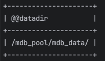  
20. Stop the MariaDB service using the following command:
    ```shell 
    sudo systemctl stop mariadb.service
    ```
21. Join the MariaDB server to the Active Directory:
    1. Edit the Samba configuration file using the following command:
       ```shell 
       sudo nano /etc/samba/smb.conf
       ```
       Update the value of the variable `netbios name` to the server node name being created in the `[global]` section. This 
       should be the only variable that needs to be updated across each server node configuration file. See the image
       below for clarification:  
       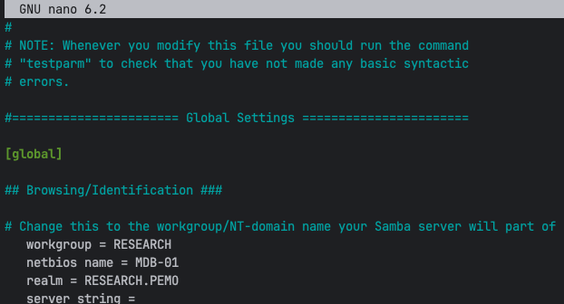  
    2. Enable and restart the `Samba` service to start up automatically at boot using the following commands:   
       ```shell
       sudo systemctl enable smbd
       ``` 
       ```shell
       sudo systemctl restart smbd
       ```
    3. Join the machine to active directory domain using the following command:
       ```shell
       sudo net ads join -S AD-01.RESEARCH.PEMO -U <user_in_ad_domain>
       ```
       `<user_in_ad_domain>` - is a user who has privileges in the AD domain to add a computer.  
    4. Enable and restart the `winbind` service to start up automatically at boot using the following commands:
       ```shell
       sudo systemctl enable winbind
       ```
       ```shell
       sudo systemctl restart winbind
       ```
       Verify that `winbind` service established a connection to the active directory domain by running the command below:
       ```shell
       sudo wbinfo -u
       ```
       This command will return a list of users from the domain that is connected via `winbind`.  

    5. Verify AD login acceptance into the machine by logging out and in with your AD account. 
22. Install `SentinelOne` cybersecurity software to detect, protect, and remove malicious software. The following sub steps
    will explain how to install `SentinelOne` by mounting a NAS (network attached storage) device then accessing the install files
    on the NAS. There are other methods for installation along with uninstalling, and upgrading `SentinelOne`, if any
    other method is needed then see the `SentinelOne` setup document that's under a PEMO Site Automation GitHub repository.  
    1. Check that the latest `SentinelOne` package is on the research scada share if not then you can download the last package
       then replace the existing package, see the image below on finding the latest package on the web management console:  
         
    2. Make note and verify the site token for the site that the machine will join, the site token for a site can be found using
       the following image for reference, click the site to find the site token:  
       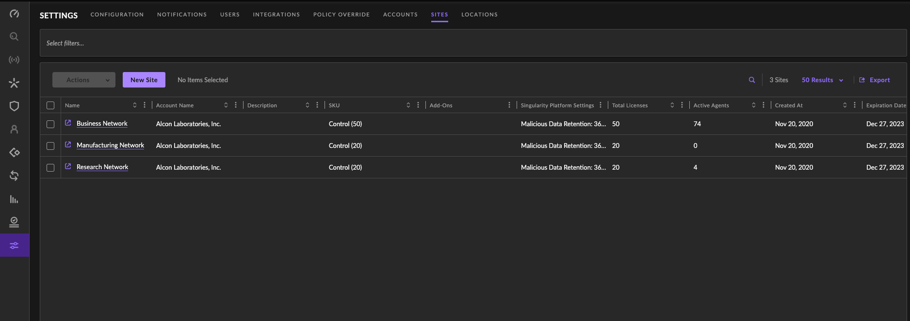  
    3. Install the network file system packages if not already installed using the following command:   
       ```shell
       sudo apt install nfs-common
       ```
    4. Create a NFS directory on the local machine to share using a similar command to the following:  
       ```shell
       sudo mkdir -p /mnt/scada/nas
       ```
    5. Allow full permissions (read, write, execute) for the owner, group and others using a similar command to the following:  
       ```shell
       sudo chmod 777 /mnt/scada/nas
       ```
    6. Check that the correct NFS share is available on the NFS server using a similar command to the following:  
       ```shell
       showmount -e cnas-01.research.pemo
       ```
       If the NFS share is not available then check the following on the NAS:  
       - Ensure the share folder is created.  
       - Check the location of the share folder.  
       - Check the NFS permission rules.  
       - See step 5 under `Deploy Galera Arbitrator` section for more solutions.  

    7. Mount the external NFS share on machine using a similar command to the following:  
       ```shell
       sudo mount -t nfs cnas-01.research.pemo:/volume1/scada /mnt/scada/nas
       ```
    8. Change directories to the location where the files and shell script are located using a similar command to the following:  
       ```shell
       sudo cd /mnt/scada/nas/program_install_files/sentinel_one
       ```
       If denied access to the NFS share then change owner of the directory using a similar command to the following:  
       ```shell
       sudo chown <user or user:group> /mnt/scada/nas
       ```
    9. Once in the `SentinelOne` directory execute the shell script `sentinelone_linux_agent_install.sh` using the following command:  
       ```shell
       sudo ./sentinelone_linux_agent_install.sh
       ```
       Ensure that the latest packages from step 1 is in the directory and that the shell script contains the correct path 
       to the latest package and site token (with respect to the site that the machine will join).
       Use the following command to open the shell script, if necessary:  
       ```shell
       sudo nano sentinelone_linux_agent_install.sh
       ```
    10. Open up the **SentinelOne** web management console and verify the machine joined the Sentinels endpoint list, check the image below:  
          
23. Repeat steps 1 - 21 above for every MariaDB server node created.  
24. Jump to step 5 in the [MariaDB Server Node Main Content Setup](#mariadb-server-node-main-content-setup) section.  
___

## Galera Cluster Setup
___
Start the Galera Cluster by bootstrapping a server node, which makes the node the primary component from which the other nodes in the cluster can sync.
The MariaDB service will be stopped on every node that is created until the cluster is initialized on one of the nodes. The initialization of the cluster can
technically be started on any server node available but typically the start of the cluster will be initialized from the first node (`mdb-01`).
___
1. Stop the MariaDB service on each server node including the node that'll be bootstrapped if the service is not already stopped using the following command:  
   ```shell
   sudo systemctl stop mariadb
   ```
2. Bootstrap `mdb-01` to form the new cluster using the following command:   
   ```shell
   sudo galera_new_cluster
   ```
   This will also automatically start the MariaDB service on **mdb-01**.
3. Start the MariaDB service on the other MariaDB server nodes using the following command:
   ```shell
   sudo systemctl start mariadb
   ```
4. Verify the status and health of the MariaDB Galera Cluster using the following SQL queries:  
   Check the cluster size:  
   ```shell
   mariadb -u root -p -e "SHOW STATUS LIKE 'wsrep_cluster_size'"
   ```
   Output should look similar to the image below:  
     
   Check all the incoming node addresses (IP and port) that are part of the cluster:  
   ```shell
   mariadb -u root -p -e "SHOW STATUS LIKE 'wsrep_incoming_addresses'"  
   ```
   Output should look similar to the image below:  
   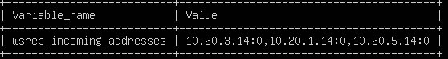  
5. Jump to step 6 in the [MariaDB Server Node Main Content Setup](#mariadb-server-node-main-content-setup) section.   
___

## Galera Arbitrator Setup
This only needs to be configured on one of the server nodes, **mdb-03** will be selected since it's the odd number node, and the donor node. 
___
1. Install Galera Arbitrator package using the following command:  
   ```shell
    sudo apt install galera-arbitrator-4
   ```
2. Create the Galera Arbitrator configuration file using the following command:
   ```shell
    sudo /etc/garbd.cnf
   ```
   Paste the text into the configuration file:
    ```ini
    # Galera Arbitrator Configuration File
    # ___
    # group - set to the same value as the wsrep_cluster_name variable in the /etc/mysql/mariadb.conf.d/60-galera.cnf file.
    # address - set to the same value as the wsrep_cluster_address variable in the /etc/mysql/mariadb.conf.d/60-galera.cnf file.
    # sst - state transfer is when a node connects to another node in the cluster and attempts to bring its local database back 
    # in sync with the cluster, and in a state snapshot transfer (sst) the donor uses a backup solution
    # to copy its data directory to the joiner. When joiner completes the sst, it begins to process the write-sets that came in 
    # during the transfer. Once it's in sync with the cluster, the cluster becomes operational again.
    # donor - the node that'll use its local database to bring another nodes databases back in sync with the cluster.
    # joiner - the node whose local database is out of sync with the other nodes in the cluster. 

    group = "mdbc-01"
    address = "gcomm://10.20.1.14:4567,10.20.5.14:4567,10.20.3.14:4567"
    options = "gmcast.listen_addr=tcp://0.0.0.0:4444"
    donor="mdb-03"
    sst="backup_rsync"
    log="/var/log/garbd.log"
    ```
3. Creat the State Snapshot Transfer Backup Script using the following command:
   ```shell
    sudo nano /usr/bin/wsrep_sst_backup_rsync
   ```
   Paste the text into the configuration file:
    ```shell
    #!/bin/bash
    
    # usage: garbd --cfg /etc/garbd.cnf
    # garbd.cnf must specify the sst as backup_rsync
    
    backup_dir = '/mnt/sql-data/backup'
    backup_sub_dir = 'rsync_files'
   
    today = `date +"%Y%m%d"`
    backup_today = "galera-rsync-backup-$today"
    
    last_week = $(date -d "$date -7 days" +"%Y%m%d")
    backup_last_week = "galera-rsync-backup-$last_week.tgz"
   
    # Load common script
    ./usr/bin/wsrep_sst_common
   
    # Copy MySQL data to temporary directory
    rsync -a /mnt/sql-data/data $backup_dir/$backup_sub_dir
   
    # Archive the data directory
    cd $backup_dir/$backup_sub_dir
    tar -czf $backup_dir/$backup_today.tgz * --transform "s,^,$backup_today/,"
   
    # Copy the file to the nas 
    cp $backup_dir/$backup_today.tgz ../nas
   
    # Delete last weeks archive
    rm -f $backup_dir/$backup_last_week  
    ```
4. Create the **backup** directory using the command below:
   ```shell
    sudo mkdir /mnt/sql-data/backup
   ```
   Allow full permissions (read, write, execute) for the owner, group and others.
   ```shell
    sudo chmod 777 /mnt/sql-data/backup
   ```
   Change the owner of the directory to a user named **mysql** in the **mysql** group.
   ```shell
    sudo chown mysql:mysql /mnt/sql-data/backup
   ```
5. Create a network file system (NFS) on the NAS (cnas-01.research.pemo) and give mdb-03 node access: 
   1. Create a NFS directory on mdb-03 to share using the following commands:
      ```shell
      sudo mkdir /mnt/sql-data/backup/nas
      ```
      Allow full permissions (read, write, execute) for the owner, group and others.
      ```shell
      sudo chmod 777 /mnt/sql-data/backup/nas
      ```
      Change the owner of the directory to a user named **mysql** in the **mysql** group.
      ```shell
      sudo chown mysql:mysql /mnt/sql-data/backup/nas
      ```
   2. Create the backup directory on the NAS using the web interface (recommended) or terminal:
      1. Web Interface:
         1. Open a web browser and enter the [CNAS-01](http://cnas-01.research.pemo:5000/) url.   
         2. Open the `Control Panel\Share Folder`, create a new share folder with the name `mdb-backup` and set new share folder with the following settings:  
            General Tab:  
              
            NFS Permissions Tab:  
              
            Encryption, Advanced, Permissions, and Advanced Permissions tabs can be left at the default settings.  
      2. Terminal: 
         ```shell
         ssh automation@cnas-01.research.pemo
         ```
         Create the directory in **volume1** directory using the following commands:
         ```shell
         cd volume1
         ```
         ```shell
         mkdir mdb-backup
         ```
   3. Install the NFS command files package on mdb-03 using the following command:
      ```shell
      sudo apt install nfs-common
      ```
   4. Mount the cnas-01 (external NFS share) on mdb-03 (local system) using the following command:
      ```shell
      sudo mount -t nfs cnas-02.research.pemo:/volume1/mdb-backup /mnt/sql-data/backup/nas
      ```
      Verify the mount using the `df` command to display the filesystem type in a human-readable format.
      ```shell
      sudo df -Th
      ```
   5. Edit the file system table configuration file using the command below:   
      ```shell 
      nano /etc/fstab
      ```
      Add the following text to the end of the file:  
      `cnas-01.research.pemo:/volume1/mdb-backup /mnt/sql-data/backup/nas nfs defaults 0 0 `  
   6. Reboot the machine and verify the mount stays attached using the `df` command:
      ```shell
      sudo df -Th
      ```
6. Test the `garbd` (Galera Arbitrator Daemon) configuration file using the following command:  
   ```shell 
   sudo garbd --cfg /etc/garbd.cnf
   ```
7. Edit the crontab using command `sudo nano /etc/crontab` file to schedule `garbd.cnf` file to run automatically at a specified time:  
   ```ini 
   7 7 * * * root garbd --cfg /etc/garbd.cnf
   ```
   The crontab expression above is as followed:  
   - `7 7 * * *` 
     - minute (0-59) 
     - hour (0-23) 
     - day of month (1-31) 
     - month (1-12)
     - day of the week (0-7)
     - "*" - is a wildcard that stands for "any"
     - The expression runs at 7:07 AM every day
   - **root** - indicates the user that the cron job should be run as. 
   - **garbd --cfg /etc/garbd.cnf** - start the galera arbitrator daemon with the **garbd.cnf** configuration file.  
   
   Check the image below on how the text should be placed in the crontab file:  
   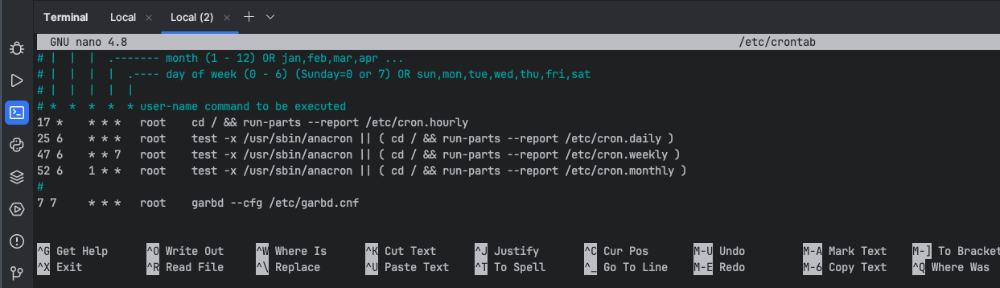  
   Restart the cron service using the command below:  
   ```shell
   sudo systemctl restart cron
   ```
8. Jump to step 7 in the [MariaDB Server Node Main Content Setup](#mariadb-server-node-main-content-setup) section.  
___

## MariaDB Backup Node Setup

8. Jump to step 8 in the [MariaDB Server Node Main Content Setup](#mariadb-server-node-main-content-setup) section.
