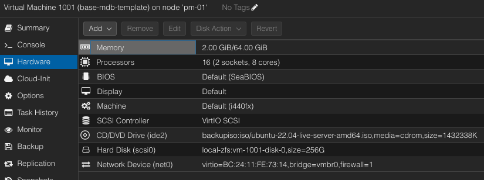
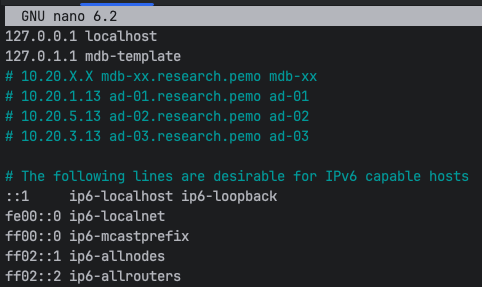
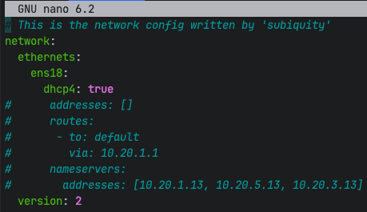
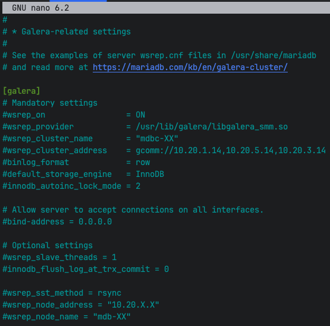
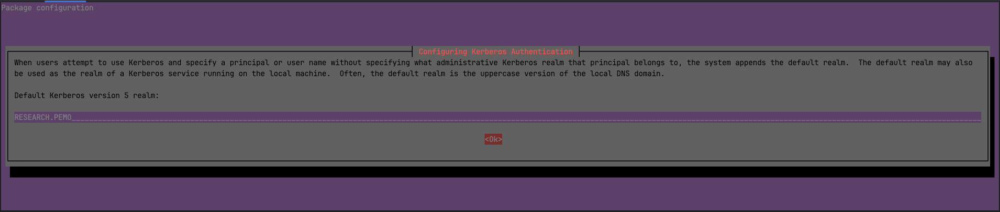
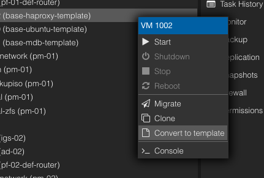

# MariaDB Virtual Machine Template Setup
Create the MariaDB VM template on **pm-01** node and then migrate the template to the other nodes 
in the cluster. 

**NOTE: Select **Ctrl+X** to exit the nano text editor, enter **Y** to save the file, and press the **Enter** key to keep the exising file name.**
___
1. Make a full clone of the template (`base-ubuntu-template`) and set the following settings below:
   > Mode = Full Clone  
   > Target Storage = Same as source  
   > Name = base-mdb-template  
   > Resource Pool = None  
   > Format = QEMU image format  
   > VM ID = <next_available_number_in_the_thousands>  

2. Update the VM configuration settings by accessing the VM management interface and selecting on the VM:  
   1. **Hardware Settings:**  
        
      > **Memory:**  
        Memory (MiB) = 65536  
        Minimum memory (MiB) = 2048  
        Ballooning Device = True  
        All other parameters = Default
      
      See the image below from modifying the hardware parameter settings from above.  
         
   
      > **Processors:**  
        Processors Sockets = 2  
        Processors Cores = 8  
        All other parameters = Default
   
   2. **Options Settings**:     
      > **QEMU Guest Agent:**   
        Use QEMU Guest Agent  = True  
        All other parameters = Default    

3. Start the Virtual Machine. 
4. Update the hostname from **base_ubuntu** to **mdb-template** using the following command:
   ```shell
   sudo nano /etc/hostname
   ```
5. Update the hosts file using the following command:
   ```shell
   sudo nano /etc/hosts
   ```
   Place the following text into the file:  
   ```text
    127.0.1.1 mdb-template
   # 10.20.X.X mdb-xx.research.pemo mdb-xx
   # 10.20.1.13 ad-01.research.pemo ad-01
   # 10.20.5.13 ad-02.research.pemo ad-02 
   # 10.20.3.13 ad-03.research.pemo ad-03
   ```
   Hosts file settings should look similar to the image below:  
       
6. Check that the network interface settings in the **00-installer-config.yaml** file are in DHCP, using the following command:  
   ```shell
   sudo nano /etc/netplan/00-installer-config.yaml
   ```
   Network settings should look similar to the image below:  
      
7. Allow incoming traffic on the database ports below, using the **ufw** command:  
    ```shell
    sudo ufw allow 43/tcp
    sudo ufw allow 443/tcp
    sudo ufw allow 3306/tcp
    sudo ufw allow 4444/tcp
    sudo ufw allow 4567/tcp
    sudo ufw allow 4568/tcp
    sudo ufw allow 4567/udp
    ```
   Verify the above rules have been accepted by issuing the below command:  
   ```shell
   sudo ufw status
   ```
8. Update and upgrade the operating system using the following commands:   
   ```shell
   sudo apt update && sudo apt upgrade -y
   ```
   **NOTE:** If prompted to select which daemon services should be restarted, then accept the defaults selections. 
             Use the tab key to navigate between selections.  
9. Reboot the machine using the following command:
   ```shell
   sudo reboot
   ```
   **NOTE**: If prompted to select which daemon services should be restarted, then accept the defaults selections. 
   Use the **tab** key to navigate between selections.  
10. Install MariaDB using the following commands:
    ```shell
    curl -LsS https://r.mariadb.com/downloads/mariadb_repo_setup | sudo bash
    ```
    ```shell
    sudo apt-get install mariadb-server galera-4 mariadb-client libmariadb3 mariadb-backup mariadb-common -y
    ```
   **NOTE**: If prompted to select which daemon services should be restarted, then accept the defaults selections. 
   Use the **tab** key to navigate between selections.   
11. Secure the installation and answer the command prompt questions using the below command:  
    ```shell
    sudo mariadb-secure-installation
    ```  
    You will then be prompted with the below questions:  
    > Switch to unix_socket authentication: **n**  
      Change the root password: **Y** (**<one_rich_cat_one_extra_rich_cat>**)   
      Remove anonymous users: **Y**  
      Disallow root login remotely: **Y**    
      Remove test database and access to it: **Y**   
      Reload privilege tables now: Y

    **NOTE**: You can also change the password for the superuser root by issuing the below command:  
    ```shell
    sudo mariadb u root
    ```
    Initiate the following query after being placed in the MariaDB interactive shell:  
    > MariaDB[(none)] > SET PASSWORD FOR 'root'@localhost = PASSWORD("<**one_rich_cat_one_extra_rich_cat**>");  

12. Configure the base galera-related settings by issuing the below command:  
    ```shell
    sudo nano /etc/mysql/mariadb.conf.d/60-galera.cnf  
    ```
    Replace the existing configuration settings under the **[galera]** section with the following settings:  
    ```shell
    [galera]
    # Mandatory settings
    #wsrep_on                 = ON
    #wsrep_provider           = /usr/lib/galera/libgalera_smm.so
    #wsrep_cluster_name       = "mdbc-XX"
    #wsrep_cluster_address    = gcomm://10.20.1.14,10.20.5.14,10.20.3.14
    #binlog_format            = row
    #default_storage_engine   = InnoDB
    #innodb_autoinc_lock_mode = 2

    # Allow server to accept connections on all interfaces.
    #bind-address = 0.0.0.0

    # Optional settings
    #wsrep_slave_threads = 1
    #innodb_flush_log_at_trx_commit = 0

    #wsrep_sst_method = rsync
    #wsrep_node_address = "10.20.X.X"
    #wsrep_node_name = "mdb-XX"
    ```
    Add any additional commented out lines according to the image below:  
     
13. Stop and the disable the MariaDB service using the following command:  
    ```shell
    sudo systemctl disable --now mariadb
    ```
    Verify the status of the MariaDB service using the following command:    
    ```shell
    sudo systemctl is-active mariadb  
    ```
14. Setup the base Active Directory settings:  
    1. Install the necessary Samba and Kerberos packages to integrate with a Windows OS network using the command below:  
       ```shell
       sudo apt install samba krb5-config krb5-user winbind libnss-winbind libpam-winbind -y 
       ```
       When prompt for the kerberos default realm type **RESEARCH.PEMO** then highlight over **Ok** and press enter as in the image below:  
         
    2. Edit the Kerberos configuration file using the **nano** command:   
        ```shell
        sudo nano /etc/krb5.conf
        ```
       Add the following to the end of **[realms]** section:  
       ```ini
       RESEARCH.PEMO = {
               kdc = AD-01.RESEARCH.PEMO
               kdc = AD-02.RESEARCH.PEMO
               kdc = AD-03.RESEARCH.PEMO
               default_domain = RESEARCH.PEMO
       }
       ```
       Add the following to the end of **[domain_realm]** section:  
       ```ini
       .research.pemo = .RESEARCH.PEMO
       research.pemo = RESEARCH.PEMO
       ```
    3. Edit the Samba configuration file using the following command:
        ```shell
        sudo nano /etc/samba/smb.conf
        ```
       Add the following text to the **[global]** section: 
       ```ini
       workgroup = RESEARCH
       netbios name = $LINUX_HOSTNAME$
       realm = RESEARCH.PEMO
       server string = 
       security = ads
       encrypt passwords = yes
       password server = AD-01.RESEARCH.PEMO
       log file = /var/log/samba/%m.log
       max log size = 50
       socket options = TCP_NODELAY SO_RCVBUF=8192 SO_SNDBUF=8192
       preferred master = False
       local master = No
       domain master = No
       dns proxy = No
       idmap uid = 10000-20000
       idmap gid = 10000-20000
       winbind enum users = yes
       winbind enum groups = yes
       winbind use default domain = yes
       client use spnego = yes
       template shell = /bin/bash
       template homedir = /home/%U
       ```
       **NOTE**: Comment out any existing variable names that are similar to the names in the new configuration for the **[global]** section above.   
        Common variables that are existing and need to be commented out:  
       
       >  **workgroup**  
          **server string**  
          **log file**  
          **max log size**  
        
    4. Edit the name service switch configuration file using the following command:
       ```shell
        sudo nano /etc/nsswitch.conf
       ```
       Replace the existing text in the file with the following: 
       ```shell
       passwd: compat winbind files systemd
       group: compat winbind files systemd
       shadow: compat winbind files
       gshadow: files
       
       hosts: files dns
       networks: files
       
       protocols: db files
       services: db files
       ethers: db files
       rpc: db files
       
       netgroup: nis
       ```
    5. Edit the **sudoers (/etc/sudoers.tmp)** configuration using the command below:  
       ```shell
       sudo visudo
       ```
       Add the following line to the end of the file:  
       ```text
       %cansudo All=(ALL:ALL) ALL
       ```
    6. Disable the **smbd** and **winbind** service using the following commands:  
       ```shell
       sudo systemctl disable --now smbd && sudo systemctl disable --now winbind
       ```
       Verify the status of each service using the following commands:  
       ```shell
       sudo systemctl is-active smbd
       ```
       ```shell
       sudo systemctl is-active winbind
       ```
    7. Ensure a user's home directory is created upon their first login, using the following command:  
       ```shell
       sudo pam-auth-update --enable mkhomedir
       ```
15. Shutdown the VM using one of following methods:
    ```shell
    sudo shutdown now
    ```
    Exit the console get into the Proxmox hypervisor web interface select the VM and manually shutting down the VM:  
      
16. Select the **CD/DVD Drive** from the **Hardware** section and remove it using the **Remove** button, see the image below:  
        
17. Make the VM a template by right-clicking on the VM and selecting **Convert to template**:  
      