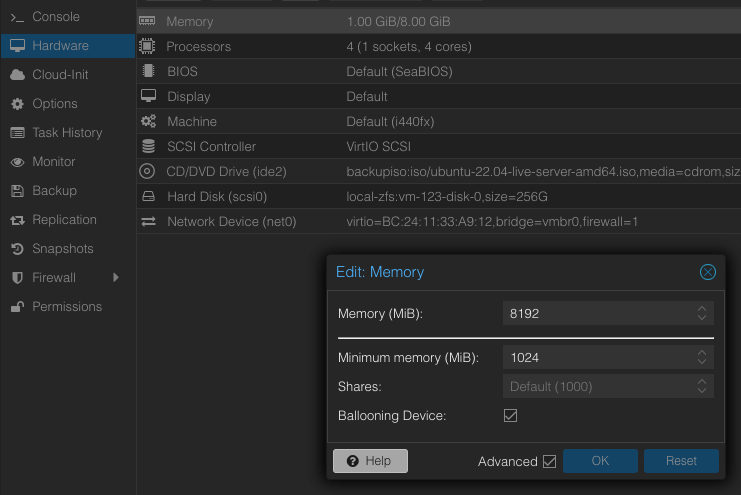
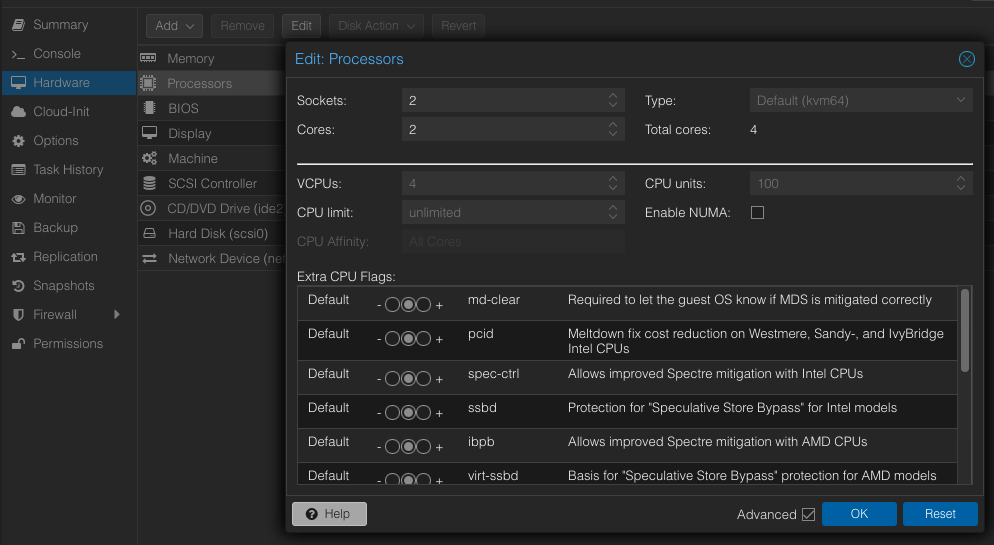
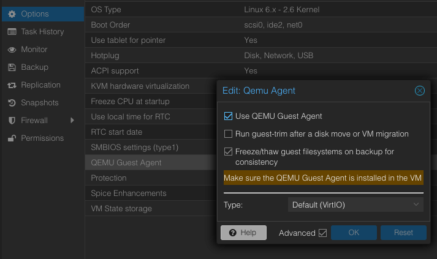
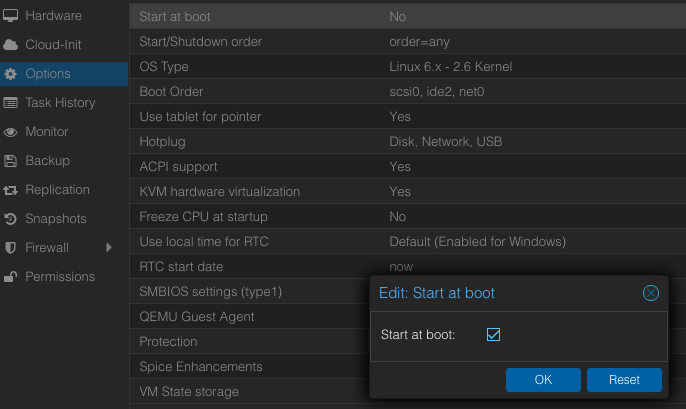
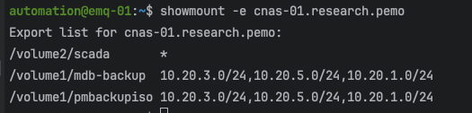

# EMQX Server Node Main Content Steps
___
1. Access the Proxmox hypervisor web interface using a web browser and enter the following url in the specified format:  
    **https://Your-Servers-IP-Address:8006/** 
2. If a base MariaDB template (**base-mdb-template**) is available, then see the 
   [MariaDB Server Node Setup](#mariadb-server-node-setup) section, if not continue in **this section** to **step 3**.   
3. If a base ubuntu template (**base-ubuntu-template**) is available, see the **mariadb_template** document then return 
   to **this document** and jump to **step 2** in **this section**, if not continue in **this section** to **step 4**.  
4. If no base Ubuntu template is available then see the **base-ubuntu build sheet** document which should be located under 
   the **scada** share on the research **NAS**.  
   1. Jump to step 3 in **this** section.
5. Jump to the [Galera Cluster Setup](#galera-cluster-setup) section.
6. Jump to the [Galera Arbitrator Setup](#galera-arbitrator-setup) section.
7. Jump to the [MariaDB Backup Node Setup](#mariadb-backup-node-setup) section.  
8. Create the MariaDB HAProxy servers using the **mariadb_haproxy** document. 

## EMQX Server Node Setup 
___
1. Right-click and perform a full clone of the base Ubuntu template (**base-ubuntu-template**) and set the following settings below:  

   > Mode = Full Clone  
   > Target Storage = Same as source  
   > Name = emq-XX (where XX is the server number being created)  
   > Resource Pool = None  
   > Format = QEMU image format  

   > NOTE: If the virtual machine needs to be under a different PROXMOX node (pm-01, pm-02, ...pm-XX) then initiate a **migration** 
     to the necessary PROXMOX node before modifying or starting the virtual machine.  

2. Update the VM configuration settings by accessing the VM management interface and selecting on the VM:  
   1. **Hardware Settings:**  
        
      > **Memory:**  
        Memory (MiB) = 8192  
        Minimum memory (MiB) = 1024  
        Ballooning Device = True  
        All other parameters = Default
      
      See the image below for modifying the **Hardware Memory** settings:   
         
   
      > **Processors:**  
        Processors Sockets = 2   
        Processors Cores = 2    
        All other parameters = Default

      See the image below for modifying the **Hardware Processor** settings:    
         
   
   2. **Options Settings**:     
      > **QEMU Guest Agent:**   
        Use QEMU Guest Agent  = True  
        All other parameters = Default    
       
      See the image below for modifying the **Option QEMU Guest Agent** settings:    
         

      > **Start at boot:**   
        Start at boot = True  
      
      See the image below for modifying the **Option Start At Boot** settings:    
         
 
3. Start the virtual machine using the **Start** button.  
4. Update the hostname from **mdb-template** to **emq-XX** (where XX is the server number being creating) using the following command:
   ```shell
   sudo nano /etc/hostname
   ```
5. Update the hosts file using the following command:  
   ```shell
   sudo nano /etc/hosts
   ```
   Remove, update, and uncomment the lines based on the image below with respect to the server being configured:  
    ```shell
    127.0.0.1 localhost
    10.20.1.XX emq-XX.research.pemo emq-XX
    10.20.1.13 ad-01.research.pemo ad-01
    10.20.5.13 ad-02.research.pemo ad-02
    10.20.3.13 ad-03.research.pemo ad-03
    ```
     
   IP Address per node server should fall within the following subnets:  
   
   > emq-01 - 10.20.1.18/24 and gateway 10.20.1.1  
   > emq-02 - 10.20.5.18/24 and gateway 10.20.5.1  
   > emq-03 - 10.20.3.18/24 and gateway 10.20.3.1  

6. Reset the machine ID using the following commands:
   ```shell
   sudo  rm  -f  /etc/machine-id /var/lib/dbus/machine-id
   sudo dbus-uuidgen --ensure=/etc/machine-id
   sudo dbus-uuidgen --ensure
   ```
7. Regenerate ssh keys using the following commands:
   ```shell
   sudo rm /etc/ssh/ssh_host_*
   sudo dpkg-reconfigure openssh-server
   ```
8. Change the network interface IP address from DHCP to Static by editing the **00-installer-config.yaml** file using the following command:   
    ```shell
    sudo nano /etc/netplan/00-installer-config.yaml
    ```
   Under the network interface key comment out the **dhcp4** key:value pair and then uncomment the remaining lines and configure the network settings accordingly see the image below:  
     
   IP Address per node server should fall within the following subnets:  
   
   > emq-01 - 10.20.1.18/24 and gateway 10.20.1.1  
   > emq-02 - 10.20.5.18/24 and gateway 10.20.5.1  
   > emq-03 - 10.20.3.18/24 and gateway 10.20.3.1  
   
9. Update and upgrade the operating system using the following commands:   
   ```shell
   sudo apt update && sudo apt upgrade -y
   ```
   **NOTE:** If prompted to select which daemon services should be restarted, then accept the default selections, 
   press the **tab** key to navigate between the selections. 
10. Restart the machine using the following command:  
    ```shell
    sudo reboot
    ```
11. Install EMQX on Ubuntu using the following commands: 
    Download the EMQX repository:  
    ```shell
    curl -s https://assets.emqx.com/scripts/install-emqx-deb.sh | sudo bash
    ```
    Install EMQX:
    ```shell
    sudo apt install emqx
    ```
    Start EMQX:
    ```shell
    sudo systemctl start emqx
    ```
12. Edit the main EMQX broker configuration file using the following command:  
    ```shell 
    sudo nano /etc/emqx/emqx.conf
    ```
    Overwrite the existing HOCON (Human-Optimized Config Object Notation) file with the following configuration:  
    ```shell
    node {
      # XX represents the last two octets of the server where EMQX is being configured
      name = "emqx@10.20.XX.XX"
      cookie = "5u#k4UGe9nX#^9"
      data_dir = "/var/lib/emqx"
    }

    cluster {
    name = emqxcl
    # emqx ctl cluster
    discovery_strategy = static
    static {
      seeds = ["emqx@10.20.1.18", "emqx@10.20.5.18", "emqx@10.20.5.18"]
    }
    proto_dist = inet_tcp
    driver = tcp
    }

    dashboard {
        listeners.http {
            bind = 18083
        }
    }
    listeners.tcp.default {
      bind = "0.0.0.0:1883"
      proxy_protocol = true
      # Defaults to infinity
      # max_connections = 1024000
    }
    ```
    emqx ctl cluster status
13. Setup the firewall rules to allow incoming traffic from the following types of traffic using the following commands: 
    ```shell
    sudo ufw allow 1883/tcp
    sudo ufw allow 4370/tcp
    sudo ufw allow 5370/tcp
    sudo ufw allow 8080/tcp
    sudo ufw allow 8084/tcp
    sudo ufw allow 8404/tcp
    sudo ufw allow 18083/tcp
    ```
    Verify the firewall rules were accepted using the following command:  
    ```shell
    sudo ufw status numbered
    ```

14. Copy everything from **/var/lib/mysql/** directory to the data directory recursively while preserving the file attributes using the command below:
    ```shell
    sudo cp -R -p /var/lib/mysql/* /mdb_pool/mdb_data/
    ```
15. Initialize the galera custer, which also starts the MariaDB service, using the following command:  
    ```shell 
    sudo galera_new_cluster
    ```
    The status of the MariaDB service can be checked using the following command:  
    ```shell 
    sudo systemctl is-active mariadb.service
    ```
16. Verify that **datadir** system variable holds the new path to the data directory using the command:
    ```shell
    mariadb -u root -p -e "SELECT @@datadir"
    ```
    Output should look like the image below:  
      
17. Stop the MariaDB service using the following command:
    ```shell 
    sudo systemctl stop mariadb.service
    ```
18. Join the EMQX server to the Active Directory:
    1. Edit the Samba configuration file using the following command:
       ```shell 
       sudo nano /etc/samba/smb.conf
       ```
       Update the value of the variable **netbios name** to the server node name being created in the **[global]** section. This 
       should be the only variable that needs to be updated across each server node configuration file. See the image
       below for clarification:  
         
    2. Start and enable the **Samba** service using the following command:   
       ```shell
       sudo systemctl enable --now smbd
       ```
    3. Join the machine to active directory domain using the following command:  
       ```shell
       sudo net ads join -S AD-01.RESEARCH.PEMO -U <user_in_ad_domain>
       ```
       **NOTE:** **<user_in_ad_domain>** - is a user who has privileges in the AD domain to add a computer.  
    4. Start and enable the **winbind** service using the following command:  
       ```shell
       sudo systemctl enable --now winbind
       ```
       Verify that **winbind** service established a connection to the active directory domain by running the command below:  
       ```shell
       sudo wbinfo -u
       ```
       **NOTE:** This command will return a list of users from the domain that is connected via **winbind**.   

    5. Verify AD login acceptance into the machine by logging out/in with your AD account.  
19. Install **SentinelOne** cybersecurity software to detect, protect, and remove malicious software.   
    > The following sub steps will explain how to install **SentinelOne** by mounting a NAS (network attached storage) 
      device, then accessing the installation files on the NAS. There are other methods for installation along with uninstalling, 
      and upgrading **SentinelOne**, if any other method is needed then see the **SentinelOne** setup document 
      under a PEMO Site Automation GitHub repository.  
    
    1. Check that the latest **SentinelOne** package is on the research scada share if not then you can download the last package
       then replace the existing package, see the image below on finding the latest package on the web management console:  
         
    2. Make note and verify the site token for the site that the machine will join, the site token for a site can be found using
       the following image for reference, click the site to find the site token:  
         
    3. Install the network file system packages if not already installed using the following command:   
       ```shell
       sudo apt install nfs-common -y
       ```
    4. Create a NFS directory on the local machine to share using a similar command to the following:  
       ```shell
       sudo mkdir -p /mnt/scada/nas
       ```
    5. Allow full permissions (read, write, execute) for the owner, group and others using a similar command to the following:  
       ```shell
       sudo chmod 777 /mnt/scada/nas
       ```
    6. Check that the correct NFS share is available on the NFS server using a similar command to the following:  
       ```shell
       showmount -e cnas-01.research.pemo
       ```
       The following image will show the NFS shares available, from issuing the above command:  
          
       If the NFS share is not available, then check the following on the NAS:  
       - Ensure the share folder is created.  
       - Check the location of the share folder.  
       - Check the NFS permission rules.  
       - See **step 5** under [Galera Cluster Setup](#galera-cluster-setup) section for more solutions.  

    7. Mount the external NFS share on machine using a similar command to the following:  
       ```shell
       sudo mount -t nfs cnas-01.research.pemo:/volume1/scada /mnt/scada/nas
       ```
    8. Change directories to the location where the files and shell script are located using a similar command to the following:  
       ```shell
       cd /mnt/scada/nas/program_install_files/sentinel_one
       ```
       **NOTE:** If denied access to the NFS share then change owner of the directory using a similar command to the following:  
       ```shell
       sudo chown <user or user:group> /mnt/scada/nas
       ```
    9. Once in the **SentinelOne** directory execute the shell script **sentinelone_linux_agent_install.sh** using the following command:  
       ```shell
       sudo ./sentinelone_linux_agent_install.sh
       ```
       **NOTE:** Ensure that the latest packages from step 1, are in the directory and that the shell script 
       contains the correct path to the latest package and site token (with respect to the site that the machine will join).
       Use the following command to open the shell script, if necessary:  
       ```shell
       sudo nano sentinelone_linux_agent_install.sh
       ```
    10. Open up the **SentinelOne** web management console and verify the machine joined the Sentinels endpoint list, check the image below:  
          
20. Repeat steps 1–21 above, for every MariaDB server node created.  
21. Jump to step 5 in the [MariaDB Server Node Main Content Setup](#mariadb-server-node-main-content-steps) section.  

## Galera Cluster Setup
Start the Galera Cluster by bootstrapping a server node (**mdb-01**), which makes the node the primary component 
from which the other nodes in the cluster can sync. The MariaDB service should be stopped on every node that'll 
join the cluster. The initialization of the cluster can technically be started on any server node available, 
but typically the start of the cluster will be initialized from the first node (**mdb-01**).
___
1. Bootstrap **mdb-01** to form the new cluster using the following command:   
   ```shell
   sudo galera_new_cluster
   ```
   This will also automatically start the MariaDB service on **mdb-01**.
2. Start and enable the MariaDB service on the other MariaDB server nodes using the following command:
   ```shell
   sudo systemctl enable --now mariadb
   ```
3. Verify the status and health of the MariaDB Galera Cluster using the following SQL queries:  
   Check the cluster size:  
   ```shell
   mariadb -u root -p -e "SHOW STATUS LIKE 'wsrep_cluster_size'"
   ```
   Output should look similar to the image below:  
     
   Check all the incoming node addresses (IP and port) that are part of the cluster:  
   ```shell
   mariadb -u root -p -e "SHOW STATUS LIKE 'wsrep_incoming_addresses'"  
   ```
   Output should look similar to the image below:  
     
   **NOTE:** The commands above can be executed from any server node that has successfully joined the cluster.  
4. Jump to step 6 in the [MariaDB Server Node Main Content Setup](#mariadb-server-node-main-content-steps) section.   

## Galera Arbitrator Setup
This only needs to be configured on one of the server nodes, **mdb-03** will be selected since it's the odd number node, and the donor node. 
___
1. Install Galera Arbitrator package using the following command:  
   ```shell
    sudo apt install galera-arbitrator-4
   ```
2. Create the Galera Arbitrator configuration file using the following command:
   ```shell
    sudo nano /etc/garbd.cnf
   ```
   Paste the text into the configuration file:
    ```ini
    # Galera Arbitrator Configuration File
    # ___
    # group - set to the same value as the wsrep_cluster_name variable in the /etc/mysql/mariadb.conf.d/60-galera.cnf file.
    # address - set to the same value as the wsrep_cluster_address variable in the /etc/mysql/mariadb.conf.d/60-galera.cnf file.
    # sst - state transfer is when a node connects to another node in the cluster and attempts to bring its local database back 
    # in sync with the cluster, and in a state snapshot transfer (sst) the donor uses a backup solution
    # to copy its data directory to the joiner. When joiner completes the sst, it begins to process the write-sets that came in 
    # during the transfer. Once it's in sync with the cluster, the cluster becomes operational again.
    # donor - the node that'll use its local database to bring another nodes databases back in sync with the cluster.
    # joiner - the node whose local database is out of sync with the other nodes in the cluster. 

    group="mdbc-01"
    address="gcomm://10.20.1.14:4567,10.20.5.14:4567,10.20.3.14:4567"
    options="gmcast.listen_addr=tcp://0.0.0.0:4444"
    donor="mdb-03"
    sst="backup_rsync"
    log="/var/log/garbd.log"
    ```
3. Creat the State Snapshot Transfer Backup Script using the following command:
   ```shell
    sudo nano /usr/bin/wsrep_sst_backup_rsync
   ```
   Paste the text into the configuration file:
    ```shell
    #!/bin/bash
    # shebang (#!) at the top of the script to know which interpreter to use.
    
    # usage: garbd --cfg /etc/garbd.cnf
    # garbd.cnf must specify the sst as backup_rsync
    
    backup_dir='/mdb_pool/mdb_backup'
    backup_sub_dir='rsync_files'
   
    today=`date +"%Y%m%d"`
    backup_today="galera-rsync-backup-$today"
    
    last_week=$(date -d "$date -7 days" +"%Y%m%d")
    backup_last_week="galera-rsync-backup-$last_week.tgz"
   
    # Load common script
    /usr/bin/wsrep_sst_common
   
    # Copy MariaDB data to temporary directory
    rsync -a /mdb_pool/mdb_data $backup_dir/$backup_sub_dir
   
    # Archive the data directory
    cd $backup_dir/$backup_sub_dir
    tar -czf $backup_dir/$backup_today.tgz * --transform "s,^,$backup_today/,"
   
    # Copy the file to the nas 
    cp $backup_dir/$backup_today.tgz /mnt/mdb_data_backups/nas
   
    # Delete last weeks archive
    rm -f $backup_dir/$backup_last_week  
    ```
4. Make the file an executable using the following command:  
    ```shell
    sudo chmod +x /usr/bin/wsrep_sst_backup_rsync
    ```
5. Create the MariaDB ZFS backup file system using the following command:    
    ```shell
     sudo zfs create mdb_pool/mdb_backup
    ```
    Issue the following command to verify the creation of the ZFS file system:   
    ```shell
    sudo zfs list
    ```
   Allow full permissions (read, write, execute) for the owner, group and others.
   ```shell
    sudo chmod 777 /mdb_pool/mdb_backup
   ```
   Change the owner of the directory to a user named **mysql** in the **mysql** group.
   ```shell
    sudo chown mysql:mysql /mdb_pool/mdb_backup
   ```
6. Create a network file system (NFS) on the NAS (cnas-01.research.pemo) and give mdb-03 node access: 
   1. Create a NFS directory on mdb-03 to share using the following commands:
      ```shell
      sudo mkdir -p /mnt/mdb_data_backups/nas
      ```
      Allow full permissions (read, write, execute) for the owner, group and others.
      ```shell
      sudo chmod 777 /mnt/mdb_data_backups/nas
      ```
      Change the owner of the directory to a user named **mysql** in the **mysql** group.
      ```shell
      sudo chown mysql:mysql /mnt/mdb_data_backups/nas
      ```
   2. Create the backup directory on the NAS using the web interface (recommended) or terminal:
      1. Web Interface:
         1. Open a web browser and enter the url [http://cnas-01.research.pemo:5000/](http://cnas-01.research.pemo:5000/).  
         2. Open the **Control Panel > Share Folder**, create a new share folder with the name **mdb-backup** and set new share folder with the following settings:  
            General Tab:  
              
            NFS Permissions Tab:  
              
            Encryption, Advanced, Permissions, and Advanced Permissions tabs can be left at the default settings.  
      2. Terminal: 
         ```shell
         ssh automation@cnas-01.research.pemo
         ```
         Create the directory in **volume1** directory using the following commands:
         ```shell
         cd volume1
         ```
         ```shell
         mkdir mdb-backup
         ```
   3. Install the NFS common packages on mdb-03 using the following command:
      ```shell
      sudo apt install nfs-common
      ```
   4. Mount the cnas-01 (external NFS share) on mdb-03 (local system) using the following command:
      ```shell
      sudo mount -t nfs cnas-01.research.pemo:/volume1/mdb-backup /mnt/mdb_data_backups/nas
      ```
      Verify the mount using the **df** command to display the filesystem type in a human-readable format.
      ```shell
      sudo df -Th
      ```
   5. Edit the file system table configuration file using the command below:   
      ```shell 
      sudo nano /etc/fstab
      ```
      Add the following text to the end of the file:  
      ```shell
      cnas-01.research.pemo:/volume1/mdb-backup /mnt/mdb_data_backups/nas nfs defaults 0 0  
      ```
   7. Reboot the machine and verify the mount stays attached using the **df** command:
      ```shell
      sudo df -Th
      ```
7. Test the **garbd** (Galera Arbitrator Daemon) configuration file using the following command:  
   ```shell 
   sudo garbd --cfg /etc/garbd.cnf
   ```
   Check that a MariaDB backup exists in the CNAS-01 share and local MariaDB ZFS by issuing the following commands:  
   ```shell 
   sudo ls -sh /mnt/mdb_data_backups/nas/
   ```
   ```shell 
   sudo ls -sh /mdb_pool/mdb_backup/
   ```
   Remove the backups from the CNAS-01 share and local MariaDB ZFS after testing and verification,
   by issuing the following commands:  
   ```shell 
   sudo rm -rf /mnt/mdb_data_backups/nas/*
   ```
   ```shell
   sudo rm -rf /mdb_pool/mdb_backup/*
   ```
8. Edit the crontab using the following command:  
   ```shell
   sudo nano /etc/crontab
   ```   
   Place the following text to schedule **garbd** configuration file to run automatically at a specified time at the end of the file:  
   ```shell
   7 7 * * * root garbd --cfg /etc/garbd.cnf
   ```
   The crontab expression above is as followed:  
   - `7 7 * * *` 
     - minute (0-59) 
     - hour (0-23) 
     - day of month (1-31) 
     - month (1-12)
     - day of the week (0-7)
     - "*" - is a wildcard that stands for "any"
     - The expression runs at 7:07 AM every day
   - **root** - indicates the user that the cron job should be run as. 
   - **garbd --cfg /etc/garbd.cnf** - start the galera arbitrator daemon with the **garbd.cnf** configuration file.  
   
   Check the image below on how the text should be placed in the crontab file:  
     
   Restart the cron service using the command below:  
   ```shell
   sudo systemctl restart cron
   ```
9. Jump to step 7 in the [MariaDB Server Node Main Content Setup](#mariadb-server-node-main-content-steps) section.  

## MariaDB Backup Node Setup
___
1. Jump to step 8 in the [MariaDB Server Node Main Content Setup](#mariadb-server-node-main-content-steps) section.
