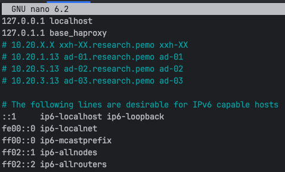
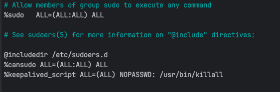

## Create Base HAProxy VM Template
This document is merely to give a starting point for an HAProxy VM with base settings. When creating a clone of this template
parameter value placeholders that exist in various configuration files will need to be updated, additional configuration files 
might need to be created, and existing or new daemon services will need to started. 
___
1. Make a full clone of the template (`base-ubuntu-template`) and set the following settings below:

   > Mode = Full Clone  
   > Target Storage = Same as source  
   > Name = base-haproxy-template  
   > Resource Pool = None  
   > Format = QEMU image format  
   > VM ID = <next_available_address_in_the_thousands>  
    
   **Leave the default VM hardware settings and start the VM.** 
2. Update the hostname from `baseubuntu` to `base-haproxy` using the following command:
   ```shell
   sudo nano /etc/hostname
   ```
3. Edit the hosts file using the following command:
   ```shell
   sudo nano /etc/hosts
   ```
   Place the following text into the file:  
   ```shell
   127.0.1.1 base_haproxy
   # 10.20.X.X xxh-XX.research.pemo xxh-XX
   # 10.20.1.13 ad-01.research.pemo ad-01
   # 10.20.5.13 ad-02.research.pemo ad-02 
   # 10.20.3.13 ad-03.research.pemo ad-03
   ```
   Settings should look similar to the image below:  
   
4. Leave the network interface settings in the `00-installer-config.yaml` yaml file in **DHCP**.   
5. Allow the HAproxy Runtime API service tcp port 8404, using the `ufw` command:  
   ```shell
    sudo ufw allow 8404/tcp
   ```
   Verify the above rules have been accepted by issuing the below command:  
   ```shell
   sudo ufw status
   ```
6. Reboot the machine using the following command:  
   ```shell
   sudo reboot
   ```
7. Check for OS updates by issuing the following commands in the order below:  
   ```shell
   sudo apt-get update
   sudo apt-get upgrade
   ```
8. If prompted to select which daemon services should be restarted, then accept the defaults selections.  
9. Setup the base Active Directory settings:
   1. Install the necessary Samba and Kerberos packages to integrate with a Windows OS network using the command below:  
      ```shell
      sudo apt install samba krb5-config krb5-user winbind libnss-winbind libpam-winbind -y 
      ```
      When prompt for the kerberos default realm type `RESEARCH.PEMO` then highlight over `Ok` and press enter as in the image below:   
      
   2. Edit the Kerberos configuration file using the `nano` command:   
       ```shell
       sudo nano /etc/krb5.conf
       ```
       Add the following to the end of `[realms]` section:
      ```ini
            RESEARCH.PEMO = {
               kdc = AD-01.RESEARCH.PEMO
               kdc = AD-02.RESEARCH.PEMO
               kdc = AD-03.RESEARCH.PEMO
               default_domain = RESEARCH.PEMO
             }
      ```
      Add the following to the end of `[domain_realm]` section:  
      ```ini
      .research.pemo = .RESEARCH.PEMO
      research.pemo = RESEARCH.PEMO
      ```
   3. Edit the Samba configuration file using the `nano` command:  
      ```shell
      sudo nano /etc/samba/smb.conf
      ```
      Add the following to the `[global]` section:
      ```ini
      workgroup = RESEARCH
      netbios name = $LINUX_HOSTNAME$
      realm = RESEARCH.PEMO
      server string = 
      security = ads
      encrypt passwords = yes
      password server = AD-01.RESEARCH.PEMO
      log file = /var/log/samba/%m.log
      max log size = 50
      socket options = TCP_NODELAY SO_RCVBUF=8192 SO_SNDBUF=8192
      preferred master = False
      local master = No
      domain master = No
      dns proxy = No
      idmap uid = 10000-20000
      idmap gid = 10000-20000
      winbind enum users = yes
      winbind enum groups = yes
      winbind use default domain = yes
      client use spnego = yes
      template shell = /bin/bash
      template homedir = /home/%U
      ```
   4. Edit the name service switch configuration file using the `nano` command:  
      ```shell
       sudo nano /etc/nsswitch.conf
      ```
      Add the following to the configuration file:   
      ```text
      passwd: compat winbind files systemd
      group: compat winbind files systemd
      gshadow: compat winbind files
       
      hosts: files dns
      networks: files
       
      protocols: db files
      services: db files
      ethers: db files
      rpc: db files
       
      netgroup: nis
      ```
   5. Edit the `/etc/sudoers.tmp` sudoers configuration using the command below:   
      ```shell
       sudo visudo
      ```
      Add the following line to the end of the file:  
      ```text
      %cansudo All=(ALL:ALL) ALL
      ```
   6. Ensure a user's home directory is created upon their first login, using the following command:  
      ```shell
      sudo pam-auth-update --enable mkhomedir
      ```
10. Edit the `/etc/sysctl.conf` file using the following command:
    ```shell
    sudo nano /etc/sysctl.conf
    ```
    Place the following kernel parameter at the end of the file:
    ```text
    net.ipv4.ip_nonlocal_bind = 1
    ```
    **Note: This enables the application to bind to an IP address that is nonlocal, meaning the IP address is not assigned to a
    device on the current system. In the case of the high availability system setup (heartbeat or fail over setup) where
    one system takes over another system's IP address if that system fails.**  
11. Add and install the HAProxy repository, target package, and hard dependencies using the following command:  
    ```shell
    apt-get install --no-install-recommends software-properties-common
    ```
    Add the vbernat/haproxy-2.8 PPA (Personal Package Archive) to the systems software repositories:  
    ```shell
    add-apt-repository ppa:vbernat/haproxy-2.8
    ```
    Install haproxy package in the 2.8.x range or greater:  
    ```shell
    apt-get install haproxy=2.8.\*
    ```
    **Note: if there exist a newer LTS ONLY VERSION past 2.8 then simply replace 2.8 with the latest **LTS** version.** 
12. Create the base main `keepalived` file for load balancing and high-availability using the following command:
    ```shell
    sudo nano /etc/keepalived/keepalived.conf
    ```
    Place the following text into the `keepalived.conf` file:
    ```shell
    global_defs {
            # Enable script security to run check_haproxy script and prevent unauthorized scripts from being executed.
            enable_script_security
    }
    
    # Define a health check script that Keepalived will run periodically to monitor the health of the service.
    vrrp_script check_haproxy {
            # Command that the VRRP script will execute to check the health of the service.
            # Sends 0 to any haproxy process which checks if it's possible to send signals to the process, effectively checking if the process is running.
            script "/usr/bin/sudo /usr/bin/killall -0 haproxy"
            # Determines how often in seconds the script will run.
            interval 2
            # Determines the weight that will be subtracted from the priority of the VRRP instance. If haproxy isn't running, then 2 will be subtracted from the priority
            # which should will cause a failover to the other VRRP instance.
            weight 2
    }

    # Virtual interface
    vrrp_instance VI_01 {
            # Default state of the node as either a Master or Slave, uncomment only one of state parameters.
            state MASTER
            #state BACKUP
            interface ens18
            # Use the last octet of the shared virtual ip address to set the id.
            virtual_router_id 11
            # The priority specifies the order in which the assigned interface to take over in a failover.
            # Higher priority value sets the node as active and the other as standby, uncomment only one of the priority parameters.
            priority 101
            #priority 100

            # The virtual ip address shared between the two load balancers.
            # This will change per active/standby pair.
            virtual_ipaddress {
                    10.20.20.11
            }

            # Associate the health check script check_haproxy with the VRRP instance.
            track_script {
                    check_haproxy
            }
    }
    ```
    **The configuration file will need to be created and the following parameters will change per active/standby pair:**
   > lvs_id
   > state  
   > interface - Interface parameter may or may not change check the interface name being used.  
   > virtual_router_id  
   > priority  
   > virtual_ipaddress

13. Create the **keepalived_script** user:  
   ```shell
   sudo groupadd -r keepalived_script
   sudo useradd -r -s /sbin/nologin -g keepalived_script -M keepalived_script
   ```
14. Edit the **sudoers (/etc/sudoers.tmp)** configuration using the command below:  
    ```shell
    sudo visudo
    ```
    Add the following line to the end of the file:
    ```shell
    %keepalived_script ALL=(ALL) NOPASSWD: /usr/bin/killall
    ```
    The updated **sudoers** configuration file should look similar to the image below:  
      
15. Ensure that the **keepalived** service is stopped using the following command:  
    ```shell
    sudo systemctl stop keepalived
    ```
    The status of the **keepalived** service can be checked using the following command:  
    ```shell
    sudo systemctl status keepalived
    ```
16. Shutdown the VM.  
17. Make the VM a template by right-clicking on the VM and selecting `Convert to template`.  
