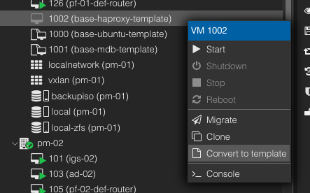

# HAProxy Virtual Machine Template Setup
This document is merely to give a starting point for an HAProxy VM with base settings. When creating a clone of this template,
the parameter value placeholders that exist in the various configuration files will need to be updated, additional configuration 
files might need to be created, and existing or new daemon services will need to started or installed. 

**NOTE**: Select **Ctrl+X** to exit the nano text editor, enter **Y** to save the file, and press the **Enter** key to keep the exising file name.
___
1. Make a full clone of the template (**base-ubuntu-template**) and set the following settings below:

   > Mode = Full Clone  
   > Target Storage = Same as source  
   > Name = base-haproxy-template  
   > Resource Pool = None  
   > Format = QEMU image format  
   > VM ID = <next_available_address_in_the_thousands>  
    
   **Leave the default VM hardware settings and start the VM.** 
2. Update the hostname from **base_ubuntu** to **base-haproxy** using the following command:   
   ```shell
   sudo nano /etc/hostname
   ``` 
3. Edit the hosts file using the following command:  
   ```shell
   sudo nano /etc/hosts
   ```
   Place the following text into the file:  
   ```shell
   127.0.1.1 base-haproxy
   # 10.20.X.X xxh-XX.research.pemo xxh-XX
   # 10.20.1.13 ad-01.research.pemo ad-01
   # 10.20.5.13 ad-02.research.pemo ad-02 
   # 10.20.3.13 ad-03.research.pemo ad-03
   ```
   Settings should look similar to the image below:  
     
4. Check that the network interface settings in the **00-installer-config.yaml** file are in DHCP, using the following command:  
   ```shell
   sudo nano /etc/netplan/00-installer-config.yaml
   ```
   Network settings should look similar to the image below:  
     
5. Allow tcp port 8404 for access to the haproxy static web page, the port is arbitrary, using the **ufw** command:  
   ```shell
    sudo ufw allow 8404/tcp
   ```
   Verify the above rules have been accepted by issuing the below command:  
   ```shell
   sudo ufw status
   ```
6. Update and upgrade the operating system using the following commands:   
   ```shell
   sudo apt update && sudo apt upgrade -y
   ```
   **NOTE:** If prompted to select which daemon services should be restarted, then accept the defaults selections, 
   press the **tab** key to navigate between the selections.  

7. Reboot the machine using the following command:  
   ```shell
   sudo reboot
   ``` 
8. Edit the **/etc/sysctl.conf** file using the following command:  
   ```shell
   sudo nano /etc/sysctl.conf
   ```
   Place the following kernel parameter at the end of the file:  
   ```text
   net.ipv4.ip_nonlocal_bind = 1
   ```
   **NOTE:** This enables the application to bind to an IP address that is nonlocal, meaning the IP address is not assigned to a
   device on the current system. In the case of the high availability system setup (heartbeat or fail over setup) where
   one system takes over another system's IP address if that system fails.    
9. Add and install the HAProxy repository, target package, and hard dependencies using the following command:  
   ```shell
   sudo apt install --no-install-recommends software-properties-common
   ```
   Add the vbernat/haproxy-2.8 PPA (Personal Package Archive) to the systems software repositories:  
   ```shell
   sudo add-apt-repository ppa:vbernat/haproxy-2.8
   ```
   Install haproxy package in the 2.8.x range or greater:  
   ```shell
   sudo apt install haproxy=2.8.\* -y
   ```
   **NOTE:** If there exist a newer LTS ONLY VERSION past 2.8, then simply replace 2.8 with the latest **LTS** version.  
10. Install **keepalived** package using the following command:  
    ```shell
    sudo apt install keepalived -y
    ```
11. Create the base main **keepalived** file for load balancing and high-availability using the following command:  
    ```shell
    sudo nano /etc/keepalived/keepalived.conf
    ```
    Place the following text into the **keepalived.conf** file:  
    ```shell
    global_defs {
            # Enable script security to run "check_haproxy" script and prevent unauthorized scripts from being executed.
            enable_script_security
    }
    
    # Define a health check script that "Keepalived" will run periodically to monitor the health of the service.
    vrrp_script check_haproxy {
            # Command that the VRRP script will execute to check the health of the service.
            # Sends 0 to any haproxy process which checks if it's possible to send signals to the process, effectively checking if the process is running.
            script "/usr/bin/sudo /usr/bin/killall -0 haproxy"
            # Determines how often in seconds the script will run.
            interval 2
            # Determines the weight that'll be subtracted from the priority of the VRRP instance. If haproxy isn't running, 
            # then 2 will be subtracted from the priority which will cause a fail over to the other VRRP instance.
            weight 2
    }

    # Virtual interface
    vrrp_instance VI_01 {
            # The state of the node is either MASTER or BACKUP, uncomment only one of state parameters.
            state MASTER
            #state BACKUP
            interface ens18
            # Use the last octet of the shared virtual ip address to set the "virtual_router_id" parameter.
            virtual_router_id XX
            # The "priority" parameter specifies the order in which the assigned interface will take over in case of a fail over.
            # Higher "priority" parameter value sets the node as MASTER and the other as BACKUP, uncomment only one of the "priority" parameters.
            priority 101
            #priority 100

            # The virtual ip address shared between the load balancers.
            # This will change per MASTER/BACKUP pair.
            virtual_ipaddress {
                    10.20.X.X
            }

            # Associate the health check script "check_haproxy" with the VRRP instance.
            track_script {
                    check_haproxy
            }
    }
    ```
    **NOTE**: The configuration file will need to be updated and the following parameters will change per MASTER/BACKUP pair:  

   > **state** - If one node is the MASTER, the other will be the BACKUP.  
   > **interface** - Check the interface name being used.   
   > **virtual_router_id** - Use the last octet of the virtual IP address.  
   > **priority** - The MASTER (101) will have a higher priority than the BACKUP (100).    
   > **virtual_ipaddress** - Check the available IP network reserved for virtual routers.  

12. Create the **keepalived_script** group and user using the following commands:   
    ```shell
    sudo groupadd -r keepalived_script
    ``` 
    ```shell
    sudo useradd -r -s /sbin/nologin -g keepalived_script -M keepalived_script
    ```
    Verify the users group membership using the following command:  
    ```shell
    groups keepalived_script
    ```
13. Edit the **sudoers (/etc/sudoers.tmp)** configuration using the command below:  
    ```shell
    sudo visudo
    ```
    Add the following line to the end of the file:
    ```shell
    %keepalived_script ALL=(ALL) NOPASSWD: /usr/bin/killall
    ```
    The updated **sudoers** configuration file should look similar to the image below:  
      
14. Ensure that the **keepalived** and **haproxy** service is stopped and disabled to prevent the services from starting 
    at boot, using the following commands:  
    ```shell
    sudo systemctl disable --now keepalived
    ```
    ```shell
    sudo systemctl disable --now haproxy
    ```
    The status of the **keepalived** and **haproxy** service can be checked using the following commands:   
    ```shell
    sudo systemctl is-active keepalived
    ```
    ```shell
    sudo systemctl is-active haproxy
    ```
15. Setup the base Active Directory settings:
    1. Install the necessary Samba and Kerberos packages to integrate with a Windows OS network using the command below:  
       ```shell
       sudo apt install samba krb5-config krb5-user winbind libnss-winbind libpam-winbind -y 
       ```
       When prompt for the kerberos default realm type **RESEARCH.PEMO** then highlight over **Ok** and press enter as in the image below:   
       
    2. Edit the Kerberos configuration file using the following command:   
        ```shell
        sudo nano /etc/krb5.conf
        ```
        Add the following to the end of **[realms]** section:  
       ```ini
       RESEARCH.PEMO = {
               kdc = AD-01.RESEARCH.PEMO
               kdc = AD-02.RESEARCH.PEMO
               kdc = AD-03.RESEARCH.PEMO
               default_domain = RESEARCH.PEMO
       }
       ```  
       Add the following to the end of **[domain_realm]** section:  
       ```ini
       .research.pemo = .RESEARCH.PEMO
       research.pemo = RESEARCH.PEMO
       ```
    3. Edit the Samba configuration file using the following command:  
       ```shell
       sudo nano /etc/samba/smb.conf
       ```
       Add the following to the **[global]** section:  
       ```ini
       workgroup = RESEARCH
       netbios name = $LINUX_HOSTNAME$
       realm = RESEARCH.PEMO
       server string = 
       security = ads
       encrypt passwords = yes
       password server = AD-01.RESEARCH.PEMO
       log file = /var/log/samba/%m.log
       max log size = 50
       socket options = TCP_NODELAY SO_RCVBUF=8192 SO_SNDBUF=8192
       preferred master = False
       local master = No
       domain master = No
       dns proxy = No
       idmap uid = 10000-20000
       idmap gid = 10000-20000
       winbind enum users = yes
       winbind enum groups = yes
       winbind use default domain = yes
       client use spnego = yes
       template shell = /bin/bash
       template homedir = /home/%U
       ```
       **NOTE:** Comment out any existing variable names that are similar to the names in the new configuration for the **[global]** section above.   
         Common variables that are existing and need to be commented out:  

       > **workgroup**    
         **server string**   
         **log file**   
         **max log size**   

    4. Edit the name service switch configuration file using the following command:  
       ```shell
        sudo nano /etc/nsswitch.conf
       ```
       Replace the existing text in the file with the following:   
        ```shell
        passwd: compat winbind files systemd
        group: compat winbind files systemd
        shadow: compat winbind files
        gshadow: files
       
        hosts: files dns
        networks: files
       
        protocols: db files
        services: db files
        ethers: db files
        rpc: db files
       
        netgroup: nis
        ```
    5. Edit the **/etc/sudoers.tmp** sudoers configuration using the following command:   
       ```shell
        sudo visudo
       ```
       Add the following line to the end of the file:  
       ```text
       %cansudo All=(ALL:ALL) ALL
       ```
    6. Disable the **smbd** and **winbind** service using the following commands:  
       ```shell
       sudo systemctl disable --now smbd && sudo systemctl disable --now winbind
       ```
       Verify the status of each service using the following commands:  
       ```shell
       sudo systemctl is-active smbd
       ```
       ```shell
       sudo systemctl is-active winbind
       ```
    7. Ensure a user's home directory is created upon their first login, using the following command:  
       ```shell
       sudo pam-auth-update --enable mkhomedir
       ```
16. Shutdown the VM using the following command:  
    ```shell
    sudo shutdown now
    ```
17. Select the **CD/DVD Drive** from the **Hardware** section and remove it using the **Remove** button, see the image below:  
       
18. Make the VM a template by right-clicking on the VM and selecting **Convert to template**.  
      