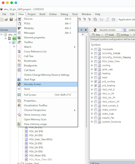

# Codesys OPC UA Server Connection
This document is intended to provide information on setting up the OPC UA Server included in Codesys V3.5 SP17 and above.
The client connection to the server will be utilized using Inductive Automation Ignition, which this document will include steps
on setting up the OPC Client using Ignition. Further steps and information on setting up the Codesys OPC UA Server
can be found using the following link [Codesys_OPC_UA_Sever](https://content.helpme-codesys.com/en/CODESYS%20Communication/_cds_runtime_opc_ua_server.html).
___

### Symbol Configuration Object
Ensure that you have created some global tags and add the symbol configuration object under the application tree.
This object is what will be used to expose the created tags to the OPC UA Server. 
> 1. Right click on the `Application` node in the left navigation tree and add the `Symbol Configuration` object.
> 2. Click into the `Symbol Configuration` object and open the `Settings` dropdown:
>       a. Check the `Support OPC UA Features`.
>       b. Select `Optimized Layout` under the `Configure Synchronisation with IEC task...` dropdown.
> 3. Select the global or program tags you want to expose and select build.
> 4. Download the new configurations.
___

### Codesys OPC UA Server Configuration
Create a Certificate for the Codesys OPC UA Server  
1. **View > Security Screen**

PROGRAM PLC_PRG
VAR
    bFirstCycle : BOOL; // variable to hold first cycle state
END_VAR
----
bFirstCycle := PLC_PRG.bFirstCycle;

IF bFirstCycle THEN
    // code that should only execute in the first scan cycle goes here
END_IF;
// other logic goes here
