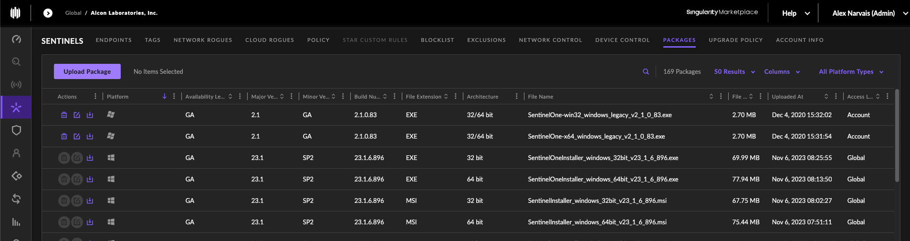

# Installing, Updating, and Removing SentinelOne
Ensure that the latest package is downloaded with respect to the OS platform the package will be installed on. 
The site token will register the machine to the correct site, so verify the correct site token matches site the machine
will join before installing the package. 
___
# Linux Machines
1. The latest SentinelOne package can be verified and downloaded from the web management console:  
     
2. The site token can be viewed and copied by clicking on the correct site:  
     
3. Install the network file system packages if not already installed using the following command:
   ```shell
   sudo apt install nfs-common
   ```
4. Create a NFS directory on the local machine to share using the following command:
   ```shell
   sudo mkdir -p /mnt/scada/nas
   ```
5. Allow full permissions (read, write, execute) for the owner, group and others"
   ```shell
   sudo chmod 777 /mnt/scada/nas
   ```
6. Change the owner of the directory to a superuser using the following.
   ```shell
   sudo chown automation /mnt/scada/nas
   ```
7. Check that the correct nfs share is available on the NFS server using the following command:
   ```shell
   showmount -e cnas-01.research.pemo
   ```
8. Mount the external NFS share on machine using the following command:
   ```shell
   sudo mount -t nfs cnas-01.research.pemo:/volume1/scada /mnt/scada/nas
   ```
9. Change directories to the location where the files and shell script are located using the following command:
   ```shell
   sudo cd /mnt/scada/nas/....
   ```
10. Open up the 
___
# Windows Machines