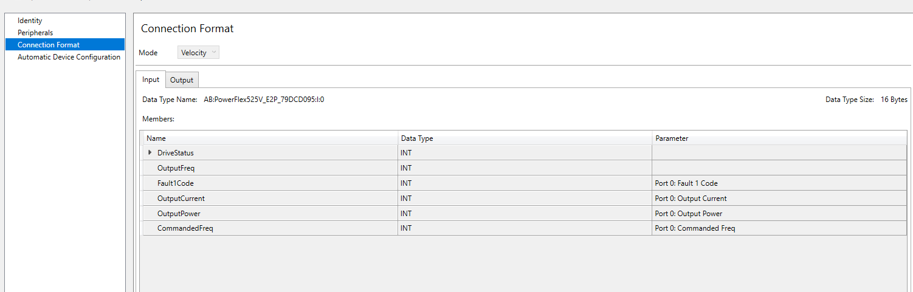

# PowerFlex 520 Series Drives Network Communication
Parameter changes can be made through the HIM, Connected Components Workbench Software, or after adding the drive to Studio 5000 
then uploading the existing configuration. If Connected Components Workbench or Studio 5000 software is used
to modify the drive parameters then first setup the network configurations to the drive using the HIM, DHCP, or BOOTP.
___

## Establishing communication to the drive using the following methods:
1. Human Interface Module (HIM)
    > - Navigate to the Port/Peripheral were the parameters will be changed, it's very important that you are changing the parameters for the correct Port/Peripheral. 
    > - Set Parameter 4 (Net Addr Sel) if using the 25-COMM-E2P Network Adapter or Parameter C128 (EN Addr Sel) if using Embedded EtherNet/IP Adapter to `Parameter` 
        to enable the network settings to be set from adapter parameters.
    > - Parameters 6-17 if using 25-COMM-E2P Network Adapter or Parameters 129-140 if using Embedded EtherNet/IP Adapter set the ip address, subnet, and, gateway.
    > - Power cycle drive.
2. BOOTP Server 
    > - Open BOOTP application and find the ethernet mac address for the interface through which communication 
        is being established.
    > - The best thing before mapping an ip address to the ethernet mac address is to first set the BOOTP server ip address
        on the same network that'll be used to assign an ip address.
    > - Disable BOOTP after the network settings are set.
___

## Network Communication 25-COMM-E2P Network Adapter
1. Parameter 23-24 (XXX Flt Action)- `Hold Last` - this will enable the drive to retain it current state if network communication is lost.
2. The following parameters need to be changed through the Powerflex Port/Peripheral which is usually zero.
    > - Parameter P43 (Minimum Frequency) - `20.00`
    > - Parameter P45 (Stop Mode) - `Coast CF`
    > - Parameter P46 (Start Source 1) and P47 (Speed Reference 1) - `Network Opt`
    > - Parameters C165-C168 (Opt Data Out 1-4) - `commanded frequency (2), current (3), power (17), and fault code (7)` - optional data that can be sent over the network.
    > - Power cycle drive.
___

## Network Communication Embedded Ethernet/IP Network Adapter
1. The following parameters need to be changed through the PowerFlex Port/Peripheral which is usually zero.
    > - Parameter P43 (Minimum Frequency) - `20.00`
    > - Parameter P45 (Stop Mode) - `Coast CF`
    > - Parameter P46 (Start Source 1) and P47 (Speed Reference 1) - `Ethernet/IP`
    > - Set Parameter C143-C144 (XXX Flt Action)- `Hold Last` - this will enable the drive to retain it current state if network communication is lost.
    > - Parameters C165-C168 (Opt Data Out 1-4) - `commanded frequency (2), current (3), power (17), and fault code (7)` - optional data that can be sent over the network.
    > - Power cycle drive.
___

## Drive Setup Studio 5000
1. Add the drive to Studio 5000 and only set the name and ip address and download the updates to the PLC.
2. Once the drive is added to Studio 5000, it can then be discovered by right-clicking the Ethernet module in the I/O tree where the drive was added.
   The actual drive configuration can then be uploaded and synchronized with the drive that's in the PLC project.
3. Verify the connection format which will display the type of data sent over the network to/from the drive:
   > - Click the drive module -> Overview -> Edit Peripherals -> Connection Format.
   > - You should then see the following:
     

